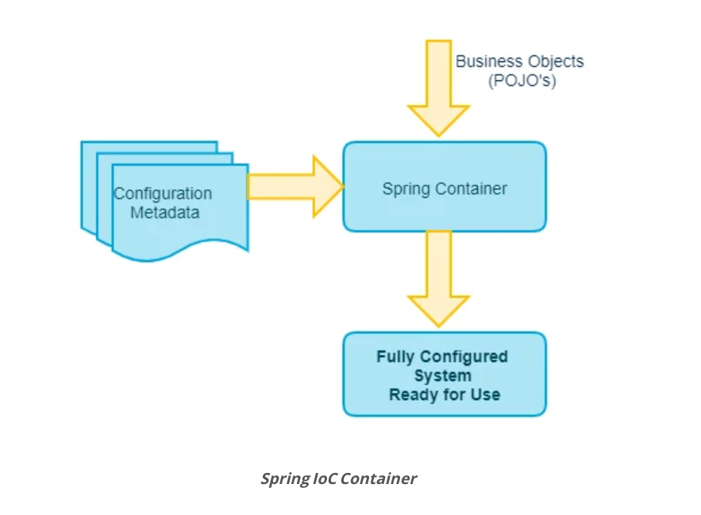
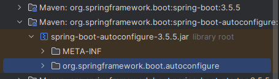
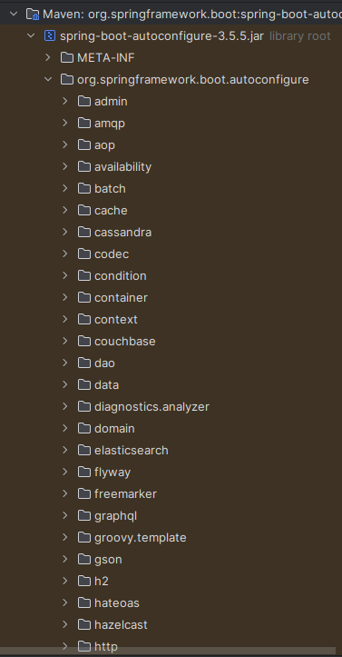
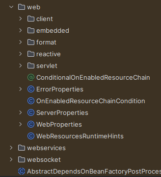
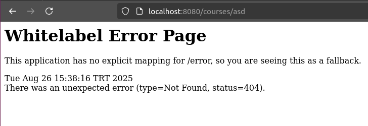
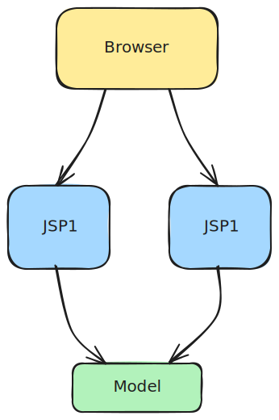
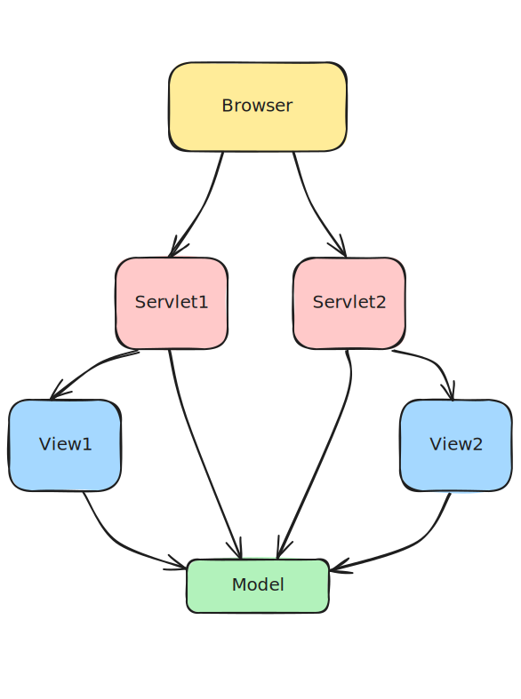
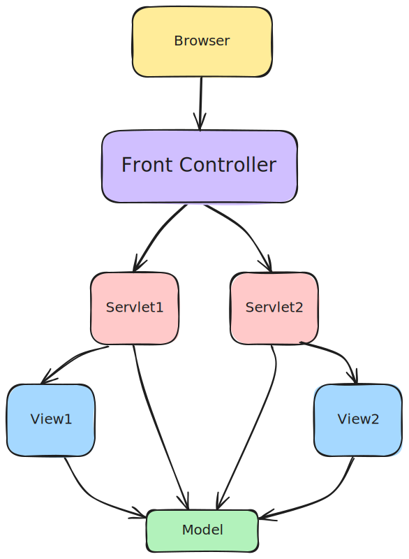

# Spring ve Spring Boot eğitimi notlar

Temel kavramlar:
* Tight Coupling and Loose Coupling
* IOC Container
* Application Context
* Component Scan
* Dependency Injection
* Spring Beans
* Auto Wiring

> Coupling: Bir şeyi değiştirmeknin ne kadar iş yükü gerektirdiğiyle ilgilidir. Tightly coupling bir sistemde en ufak bir değişiklik çok zaman alabilir, çalışan sistemi bozabiliriz. Loosly coupling bir sistemde bir parçanın değişmesi diğerlerini daha az etkileyeceğinden değişikliğin etkisi ve gerektireceği iş yükü az olacaktır.

### Tight Coupling
Class'ların instance'larını developer oluşturur.
Instance'ları kullanılacakları class'a yine developer verir. Class'lar birbirlerine doğrudan bağlıdır. Yani class A içinde class B kullanılır. Aynı işi yapmak için farklı bir tercih mesela class C kullanılacaksa class B'ye olan doğrudan bağımlılık nedeniyle kod düzenlemesi zaman alacaktır. Çözüm: interface kullanmak.

Class A içinde kullanılacak class B'nin instance'ını, A'nın içinde oluşturmak da tight coupling'dir. Hatta en alâsıdır. Eğer bağımlılık dışardan verilmezse farklı bir implementasyon lazım olduğunda yukarıda anlatıldığı gibi zorluk yaşanır. Ayrıza A class'ının test edilmesi çok zor olur. Çünkü bağımlılıkları mock'lanamaz ve A class'ını izole ederek test etmek zorlaşır. Örneğin bağımlılık bir veritabanı bağlantısı olsa o bağlantı için gerekli yığınla konfigürasyon da test sırasında hazır olmalı, yazılmalı. Yani bağımlılığın da bağımlılıkları varsa işler çorbaya döner. Her şeyi bir yerde yazmak, tanımlamak gerekebilir.

### Loose Coupling via Interfaces
Bir class'ın kullanacağı diğer class interface ile ifade edilir. Böylece sadece belirli bir concrete class'a bağımlı kalmak yerine interface'i implement eden birden çok class kullanılabilir kılınır. Yani kullanılacak class'a doğrudan bir bağımlılık söz konusu olmaz ve esneklik kazanırız.

### Loose Coupling via Spring - level 1
Spring beans (@Bean) kullanarak bir metotun bizim oluşturduğumuz instance'ı return etmesi ve uygulama içinde kullanabilmemiz.

Nesnelerin oluşturulması -> developer

Nesnelerin yönetilmesi ve birbirine bağlanması -> Spring

### Loose Coupling via Spring - level 2
Class'ların instance'larının oluşturulması işini de Spring'in yaptığı bir aşama. İlgili annotasyonlarla işaretlenen class'ın instance'ı Spring tarafından oluşturulur ve uygulamamızda kullanılabilir.

Nesnelerin oluşturulması -> Spring

Nesnelerin yönetilmesi ve birbirine otomatik bağlanması -> Spring

*Wiring*: nesnelerin birbirine bağlanması. Yani bir nesneye ihtiyacı olan diğer nesneyi vermek. Setter ya da constructor ile verilebilir. Örneğin:

```java
DbConnection myConnection = new DbConnection();

Repository myRepo = new Repository(myConnection); // Repository'ye ihtiyacı olan DbConnection Nesnesini verdik. 

```
---

### Kısaca Maven ve POM

> Maven: Özellikle java için kullanılan bir build(derleme) otomasyon aracıdır. Yazılım geliştirmenin iki yönüyle ilgilidir: yazılımın nasıl derleneceği ve bağımlılıklar.

> pom.xml (Project Object Model): Maven için gerekli. An XML file describes the software project being built, its dependencies on other external modules and components, the build order, directories, and required plug-ins. 

* Bir java maven projesinde group id ve artifact id'nin işlevi maven ekosistemindeki projeleri birbirinden ayırt etmeye yarayan değerlerdir.

> Unique Identification: The combination of Group ID and Artifact ID ensures that your project or dependency is uniquely identified across the Maven ecosystem.

> The Group ID is like a unique namespace for your project. It represents the organization or the broader package that the project belongs to, similar to a company or a domain name. A Group ID helps distinguish your project from other projects that may have similar Artifact IDs (names) but belong to different organizations.

> The Artifact ID is the name of the project or module itself. It is unique within the scope of the Group ID. Think of it as the specific identifier for a particular project or library that you’re working on or referring to. The Artifact ID is what Maven uses to download and manage dependencies in your project.


---

### @Configuration
Bir class'ı bean tanımlarının kaynağı olarak işaretler ve böylece Spring Container, tanımlanan bean'ları yönetebilir. Örnek kod:

Instance'ının oluşturulması istenen class.
```java
public class MessageService {

    public String getMessage() {
        return "Merhaba, Spring'in annotation konfigürasyon dünyasına hoş geldin!";
    }
}
```

*@Bean* ile ilgili class'ın instance'ının oluşturuluması için kullanılacak metot işaretlenir. Biz Spring'ten o class'ın bir instance'ını istediğimizde buraya bakacaktır.
```java
@Configuration
public class AppConfig {

    @Bean
    public MessageService messageService() {
        return new MessageService();
    }
}
```
Context oluşturma ve Spring'in context'te oluşturduğu bean'a ulaşma:
```java
public class MainApp {

    public static void main(String[] args) {
        // Annotation tabanlı konfigürasyonu yüklemek için context oluşturma
        ApplicationContext context = new AnnotationConfigApplicationContext(AppConfig.class);

        // Bean'i context'ten alma
        MessageService messageService = context.getBean(MessageService.class);

        // Bean'in metodunu kullanma
        System.out.println(messageService.getMessage());
    }
}
```

Özetle süreç şöyle:

Uygulama Başlangıcı: ApplicationContext oluşturulduğunda (new AnnotationConfigApplicationContext(AppConfig.class);), Spring, AppConfig sınıfını okur. *AnnotationConfigApplicationContext*, belirtilen konfigürasyon class'ını kullanarak bir Spring AApplication Context oluşturmada kullanılır.

Bean Tanımlama: AppConfig içindeki @Bean annotation'lı messageService() metodu sayesinde, Spring bu metodun döndürdüğü MessageService nesnesini oluşturur ve bunu IoC konteynerine kaydeder.

getBean() Çağrısı: context.getBean(MessageService.class) satırına geldiğinizde, Spring konteyneri içinde MessageService tipinde bir bean olup olmadığına bakar.

Var Olanı Döndürme: Spring bu bean'i bulur ve size o an hali hazırda bellekte bulunan nesnenin referansını verir.
---

### @Bean
Spring context içinde oluşturulacak nesnenin tanımlandığı ve oluşturulma kodunu içeren metotları işaretler. Böylece Spring o türden bir nesneye ihtiyaç olursa bize context içinden verir.

```java
@Bean
public Person person() {
    return new Person("Ali Yılmaz", 32);
}
```

* Context içindeki bean'ları unique kılan isimleridir. Burada bean'ın varsayılan ismi metot ismidir: 'person'
```java
Person myInstance = context.getBean("person");
```

* istersek bean adını metot isminden farklı kılabiliriz:
```java
@Bean(name = "myPerson")
public Person person() {
    return new Person("Ali Yılmaz", 32);
}
```

Bean'ın adı myPErson oldu:
```java
Person myInstance = context.getBean("myPerson");
```

### Context'teki Bean'lara erişmede alternatif
Bean'lara isimleriyle erişmek mümkün:
```java
Person myInstance = context.getBean("myPerson");
```

Diğer yandan tipine/class'ına göre de erişebiliriz:
```java
Person myInstance = context.getBean(Person.class);
```

Peki context içinde Person türünde birden çok bean varsa? Eğer isimle erişiyorsak zaten isimleri farklı olacağından sıkıntı çıkmayacaktır ama tür üzerinden erişeceksek, ki uygulama genelinde böyle kullanımlar olacaktır, o zaman hangi bean'ın istenildiği ya da varsayılan olarak hangisinin getirileceği de yapılandırılabilir. Yoksa o türden birden fazla bean olduğuna dair hata firlatılacaktır.

### Bean'ları autowire etme
Bir Bean metodu içinde context'teki diğer bean'ları kullanmamız gerekebilir. Bu durumda iki yol var: 

* diğer bean metotlarını çağırmak.

* İlgili bean metoduna diğer bean'ları isim ve türlerine dikkat ederek *parametre olarak* geçmek. Burada dikkat edilecek husus metotta @Bean annotasyonu olmazsa, metot herhangi bir metot gibi muamele görür ve parametreleri context'ten getirilmez. Ayrıca o parametrelerin daha öncesinde bean olarak tanımlanmış olmaları gerekir ki context'ten gelebilsinler.

Aşağıda örnekleri mevcut:

```java
ecord Person (String name, int age, Address address) { };

//Address - firstLine & city
record Address(String firstLine, String city){ };

@Configuration
public class HelloWorldConfiguration {
	
	@Bean
	public String name() {
		return "Ranga";
	}
	
	@Bean
	public int age() {
		return 15;
	}
	
	@Bean
	public Person person() {
		return new Person("Ravi", 20, new Address("Main Street", "Utrecht"));		
	}

    // METOT ÇAĞRIMI ile kullanım 
	@Bean
	public Person person2MethodCall() {
		return new Person(name(), age(), address()); //name, age		
	}

    // PARAMETRE olarak kullanım
	@Bean
	public Person person3Parameters(String name, int age, Address address3) {
		//name,age,address2
		return new Person(name, age, address3); //name, age		
	}

	@Bean(name = "address2")
	public Address address() {
		return new Address("Baker Street", "London");		
	}

	@Bean(name = "address3")
	public Address address3() {
		return new Address("Motinagar", "Hyderabad");		
	}

}
```

### Bazı cevaplanası sorular:
* Spring Container vs Spring Context vs IoC Container vs Application Context bunlar nedir ve farkları nelerdir?

Spring Container = Spring Context = IoC Container: Spring Bean'larını ve onların yaşam döngülerini yönetir: oluşturulması(construction), yapılandırılması(configuration) ve silinmesi (deconstruction).
Örnekleri ise şunlardır: Bean Factory ve Application Context.

Bean factory basit bir Spring Container'dır. Application Context ise daha çok kurumsal uygulamalara hitab eder.

Aşağıdaki fotoda görüleceği üzere Spring Container yazdığımız Java class'larını ve Configuration class'larını alıp birer instance'larını oluşturur. Ayrıca bu instance'ların yaşam döngüsünü yönetir.



* JPOJO vs Java Bean vs Spring Bean farkı nedir?

POJO, herhangi bir java class'ı gibi düşünülebilir, kural yok.

Java Bean (Enterprise Java Bean) ise  bazı kurallara tabi olarak yazdığımız POJO'dur: implements Serializable, public varsayılan no-args constructor, private fields, getter ve setters olmalı.

Spring Bean ise Spring (IoC) tarafından yönetilen herhangi bir nesnedir.

* Spring Framework tarafından yönetilen tün Bean'ları listelemek istersen bunu nasıl yaparız?

```java
context.getBeanDefinition(beanName); // adı verilen Bean'ın tanımını verir

context.getBeanDefinitionCount() // IoC'de tanımlı bean sayısını verir

context.getDefinitionNames(); // IoC'de tanımlı tün Bean'ların isimlerini String[] olarak verir.
```

* Birden fazla aynı türden Bean varsa ne olur?
DbConnection türünden bir bağımlılığı spring auto-wire ile bize sağlayacak olsun. Ancak biz mySqlConnnection ve mongoConnection adında iki tane bu türden Bean tanımlamış olalım.

``` java
@Bean
public DbConnection mySqlConnection() {
    return new DbConnection("mySql");
}

@Bean
public DbConnection mongoConnection() {
    return new DbConnection("mongo");
}
```
Spring DbConnection türünden iki aday instance olduğundan hangisini sana vereceğini bilemeyecek. Öyleyse içlerinden birini öncelikli olarak belirleyelim:

```java
@Bean
@Primary
public DbConnection mySqlConnection() {
    return new DbConnection("mySql");
}

@Bean
public DbConnection mongoConnection() {
    return new DbConnection("mongo");
}
```
Şimdi DbConnection türünden bir dependency auto-wire edilecekse bize mySqlConnection isimli bean gelecektir.

Bir diğer seçenek ise bean için onu ayırt edici bir isim verip ihtiyaç duyulan yerde o isim ile erişmek. Yani ihtiyaç duyulan mongo ise Spring'e bana mongoConnection'ı getir diyebiliyoruz:

```java
@Bean
@Primary
public DbConnection mySqlConnection() {
    return new DbConnection("mySql");
}

@Bean
@Qualifier("mongoQualifier")
public DbConnection mongoConnection() {
    return new DbConnection("mongo");
}

@Bean
public DbConnection sqlServerConnection() {
    return new DbConnection("sqlServer");
}
```

kullanırken de belirlenen değerle ilgili bean'ı getirmesini spring'e söyleyebiliyoruz:

Örnek 1
```java
context.getBean("mongoQualifier") // mongo için DbConnection bean'ını getirir.
```

Örnek 2
```java
// parametredeki bean auto-wire edilirken hangi instance'ın getirileceğini spring'e söyleriz
@Bean
public Repository myRepo(@Qualifier(mongoQualifier) DbConnection dbConnection) {
    return new Repository(dbConnection);
}
```


* Spring nesneleri yönetiyor ve birbirine bağlıyor (auto-wiring) ama nesneleri biz kodla oluşturmuyor muyduk? Spring nesneleri bizim yerimize nasıl oluşturuyor?


* BeanFactory vs ApplicationContext:

> BeanFactory loads beans on-demand, while ApplicationContext loads all beans at startup. Thus, BeanFactory is lightweight as compared to ApplicationContext. kaynak: https://www.baeldung.com/spring-beanfactory-vs-applicationcontext

* Default scope of a spring bean?

The Singleton scope is the default scope in Spring. In this scope, the Spring container creates a single instance of the bean, and this instance is shared across the entire application.

--- 

## Section 7-8

### @Component
Class'ların instance'larını bir konfigurasyon class'ı içinde metotlarla tanımlamak yerine Spring'in otomarik olarak oluşturmasını sağlayabiliriz.

*@Component* annotasyonu ile işaretlenen class uygulamamızın bir komponent'idir. Yani Spring'in annotasyon bazlı konfigurasyonu ve classpath taraması için bir aday class olurlar.

Yani Spring'in bir class'ın instacance'ını bizim yerimize otomatik oluşturmasını istersek o class'ı @Component ile işaretleriz.

Önce:
```java
public class PacmanGame implements GamingConsole {
	// ... some methods
}


@Configuration
public class GameConfig {

	@Bean 
	public GamingConsole pacman() {
		return new PacmanGame();
	}

	@Bean 
	public GameRunner(GamingConsole pacman) {
		return new GameRunner(pacman);
	}
}

public class Main {
	public static void main(String[] args) {
		var context = new AnnotationConfigApplicationContext(GameConfig.class);

		var gameRuner = context.getBean(GameRunner.class);
		gameRunner.run();
	}
}
```

Sonra:
```java
@Component
public class PacmanGame implements GamingConsole {
	// ... some methods
}


@Configuration
@ComponentScan
public class GameConfig {

	@Bean 
	public GameRunner(GamingConsole pacman) {
		return new GameRunner(pacman);
	}
}

public class Main {
	public static void main(String[] args) {
		var context = new AnnotationConfigApplicationContext(GameConfig.class);

		var gameRuner = context.getBean(GameRunner.class);
		gameRunner.run();
	}
}
```

PacmanGame class'ı @Component olarak işaretlendi ve böylece instance oluşturma işi spring'e verildi. Ancak uygulama içindeki component'leri nerede bulacağını @ComponentScan ile Spring'e söylemezsek 'NoSuchBeanDefinitionException' alırdık.

@ComponentScan herhangi bir parametre verilmezse kullanıldıği package ve altındaki yerlerde Component'leri arar. Parametreler vererek birden fazla package'a bakmasını ve bazen de bakmaması gereken konumları belirtebiliriz.

* Kodu Main class'ında toplayalım:

```java
@Component
public class PacmanGame implements GamingConsole {
	// ... some methods
}

@Configuration
@ComponentScan
public class Main {

	@Bean 
	public GameRunner(GamingConsole pacman) {
		return new GameRunner(pacman);
	}

	public static void main(String[] args) {
		var context = new AnnotationConfigApplicationContext(Main.class);

		var gameRuner = context.getBean(GameRunner.class);
		gameRunner.run();
	}
}
```

Artık konfigurasyonu Main içinde yaptığımızdan Context'i Maindeki yapılandırmaya göre hazırlıyoruz. Böylece daha az class yazdık denebilir.

* Şimdi GameRunner'ı da @Component ile oluşturalım:
```java
@Component
public class PacmanGame implements GamingConsole {
	// ... some methods
}

@Component
public class GameRunner {
	private GamingConsole game;

	public GameRunner(GamingConsole game) {
		this.game = game;
	}

	// ... some methods
}

@Configuration
@ComponentScan
public class Main {

	public static void main(String[] args) {
		var context = new AnnotationConfigApplicationContext(Main.class);

		var gameRuner = context.getBean(GameRunner.class);
		gameRunner.run();
	}
}
```

Böylece Spring class'larımız için hem instance oluşturdu hem de bağımlılılarını yönetti.

### @Component ile işaretli aynı türden birden fazla class varsa ve inject edilmesi gerekiyorsa
Böyle bir durumda spring bize 'NoUniqueBeanDefinitionException' hatasını firlatacaktır. Çünkü o türden oluşturulmuş hangi instance'ı kullanmak/inject etmek istediğin belirsiz.

Örneğin:
```java
@Component
public class PacmanGame implements GamingConsole {
	// ... some methods
}

@Component
public class MarioGame implements GamingConsole {
	// ... some methods
}

@Component
public class GameRunner {
	private GamingConsole game;

	public GameRunner(GamingConsole game) {
		this.game = game;
	}

	// ... some methods
}

@Configuration
@ComponentScan
public class Main {

	public static void main(String[] args) {
		var context = new AnnotationConfigApplicationContext(Main.class);

		var gameRuner = context.getBean(GameRunner.class);
		gameRunner.run();
	}
}
```

* Hatırlayalım: bu gibi durumlarda @Primary ya da @Qualifier gibi annotasyonlar kullanarak Spring'e hangi bean'ı getirmesi gerektiği söylenebilir.

Öyleyse MarioGame'i @Primary ile işaretleyelim:

```java
@Component
public class PacmanGame implements GamingConsole {
	// ... some methods
}

@Component
@Primary
public class MarioGame implements GamingConsole {
	// ... some methods
}

@Component
public class GameRunner {
	private GamingConsole game;

	public GameRunner(GamingConsole game) {
		this.game = game;
	}

	// ... some methods
}

@Configuration
@ComponentScan
public class Main {

	public static void main(String[] args) {
		var context = new AnnotationConfigApplicationContext(Main.class);

		var gameRuner = context.getBean(GameRunner.class);
		gameRunner.run();
	}
}
```

GameRunner'ın ihtiyacı olan GamingConsole türünden bean artık MarioGame olarak verilir. Çünkü spring'e GamingConsole türünden aday bean'lardan hangisnin öncelikli olarak kullanılacağı @Primary ile söylendi.

* @Qualifier ile istediğimiz Bean'ı kullanalım:

```java
@Component
@Qualifier("PacmanGameQualifier")
public class PacmanGame implements GamingConsole {
	// ... some methods
}

@Component
@Primary
public class MarioGame implements GamingConsole {
	// ... some methods
}

@Component
public class GameRunner {
	private GamingConsole game;

	public GameRunner(@Qualifier("PacmanGameQualifier") GamingConsole game) {
		this.game = game;
	}

	// ... some methods
}

@Configuration
@ComponentScan
public class Main {

	public static void main(String[] args) {
		var context = new AnnotationConfigApplicationContext(Main.class);

		var gameRuner = context.getBean(GameRunner.class);
		gameRunner.run();
	}
}
```

Spring @Qualifier("PacmanGameQualifier") ile işaretlenmiş class'ın instance'ını GameRunner'a verir ve böylece PacmanGame kullanılır.

> Diyelim ki bir A class'ını @Qualifier ile işaretlemedik ancak onu B class'ında kullanacağız. Diğer adaylardan ayrıştırmak için A class'ına qualifier verilmese bile B içinde class adıyla belirtilebilir:
```java
@Component
public class A implements MyType {

}

@Component
@Primary
public class X implements MyType {

}

@Component
@Qualifier("qualifierY")
public class Y implements MyType {

}

@Component
public class B {
	private MyType dependency;

	public B(@Qualifier("A") MyType dependency) {
		this.dependency = dependency;
	}
}
```

---

### Dependency Injection Türleri
3 tür vardır: Constructor based, Setter based ve Field.

* Constructor-based: Dependencies are set by craeting the Bean using its Constructor.

* Setter-based: Dependencies are set by calling setter methods on your behalf.

* Field: No setter or constructor. Dependency is injected using *reflection*.

**Field Injection**: reflection ile bağımlılıkların Spring tarafından oluşturulup ilgili class'a verildiği tür.

Örnek:
```java
@Component
class BusinessService {
    Dependency1 dependency1;
    Dependency2 dependency2;

    public String toString() {
        return "BusinessService{" +
                "dependency1=" + dependency1 +
                ", dependency2=" + dependency2 +
                '}';
    }
}

@Component
class Dependency1 {
    // Simulating a dependency
}

@Component
class Dependency2 {
    // Simulating another dependency
}


@Configuration
@ComponentScan
public class FieldInjectionExample {

    public static void main(String[] args) {
        try (var context = new AnnotationConfigApplicationContext(FieldInjectionExample.class)) {
            Arrays.stream(context.getBeanDefinitionNames())
                    .forEach(System.out::println);

            BusinessService businessService = context.getBean(BusinessService.class);
            System.out.println(businessService);
        } catch (Exception e) {
            e.printStackTrace();
        }
    }
}
```

Bu Örnekte çıktı olarak @Component ile işaretlenmiş class'lar için Bean oluşturulduğunu görürüz ancak BusinessService'in toString metodu çağrılınca bağımlılılarının null olduğunu görürüz:

```bash
fieldInjectionExample
businessService
dependency1
dependency2
BusinessService{dependency1=null, dependency2=null}
```

* @Autowired annotasyonu ile Spring'e bu bağımlılıkları ilgili class'a inject etmesi gerektiği söylenmeli:

```java
@Component
class BusinessService {
    @Autowired
    Dependency1 dependency1;

    @Autowired
    Dependency2 dependency2;

    public String toString() {
        return "BusinessService{" +
                "dependency1=" + dependency1 +
                ", dependency2=" + dependency2 +
                '}';
    }
}

```

Bunun sonucunda çıktımız şöyle görünecektir:
```bash
fieldInjectionExample
businessService
dependency1
dependency2
BusinessService{dependency1=com.nht.dependencyinjection.exapmle.e1.Dependency1@3cd3e762, dependency2=com.nht.dependencyinjection.exapmle.e1.Dependency2@1fa121e2}

```

**Setter Injection**: Spring'e bizim yazdığımız setter metotlarını kullanarak bağımlılıkları inject etmsini söyleyeceğiz:

Örneğin
```java
@Component
class BusinessService {
    Dependency1 dependency1;
    Dependency2 dependency2;

    @Autowired
    public void setDependency1(Dependency1 dependency1) {
        this.dependency1 = dependency1;
    }

    @Autowired
    public void setDependency2(Dependency2 dependency2) {
        this.dependency2 = dependency2;
    }

    public String toString() {
        return "BusinessService{" +
                "dependency1=" + dependency1 +
                ", dependency2=" + dependency2 +
                '}';
    }
}
```

Burada setter metotları @Autowired ile işaretlenmeseydi Spring injection'ı yapamazdı ve toString kısmında bağımlılıklar null görünecekti. Biz @Autowired kullandık ve çıktımız:

```bash
setterInjectionExample
businessService
dependency1
dependency2
BusinessService{dependency1=com.nht.dependencyinjection.example.e2.Dependency1@131ef10, dependency2=com.nht.dependencyinjection.example.e2.Dependency2@55b0dcab}
```

**Constructor Injection** Spring ilgili class'ın Constructor'ında gördüğü bağımlılıkları auto-wire eder/inject eder. Constuctor yardımıyla injection yapılırken @Autowired kullanmasak bile Spring bunu anlar ve kendi yapar.

```java
@Component
class BusinessService {
    Dependency1 dependency1;
    Dependency2 dependency2;

    public BusinessService(Dependency1 dependency1, Dependency2 dependency2) {
        this.dependency1 = dependency1;
        this.dependency2 = dependency2;
    }

    public String toString() {
        return "BusinessService{" +
                "dependency1=" + dependency1 +
                ", dependency2=" + dependency2 +
                '}';
    }
}
```

@Autowired kullanmadık ama kullanabilirdik.

Çıkıtısı:
```bash
constructorInjectionExample
businessService
dependency1
dependency2
BusinessService{dependency1=com.nht.dependencyinjection.example.e3.Dependency1@7eac9008, dependency2=com.nht.dependencyinjection.example.e3.Dependency2@4116aac9}
```

> Hangi tür injection kullanılmalı? Cevap constructor-based injection. Çünkü tek bit metotta class initialize ediliriken bağımlılıklarına sahip olur ve böylece kullanıma hazırdır.

---
### Terminoloji

* @Component: Bir class'ın nesnesidir ve Springframework tarafından yönetilir.

* Dependency: Bir class'ın ihtiyaç duyduğu diğer class. Eğer interface olarak tanımlandıysa, o türden bir implementastona ihtiyaç duyar.

* Component Scan: @Component ile işaretlenmiş class'ları tanımlandıkları paketlerde bulabilmesi için Spring'e yardımcı oluyoruz. Mesela @ComponentScan(com.nht.myproject). varsayılan olarak @ComponentScan annotasyonuyla işaretlenmiş class'ın bulunduğu paket ve altındaki paketleri tarar.

* Dependency Injection: Bean'ları tanıyıp ihtiyaç duydukları bağımlılıkları onlara oluşturup vermektir. İhtiyaç duyulan bağılılıkların oluşturulması ve bağlanması/ilgili class'a verilmesi işi framework tarafından yapılınca buna Inversion Of Control (IoC) diyoruz. Yani bu süreçte kontrol framework'tedir.

* Spring Beans: Yaşam döngüsü Spring Framework taradından yönetilen herhangi bir class'ın herhangi bir instance'ı.

* IoC container: Bean'ların yaşam döngüsü ve bağımlılıklarını yönetir. Türleri: ApplicationContext (daha karmaşık ve eager), BeanFactory(basit ve lazy).

* Autowiring: Bir Spring Bean'ı için bağımlılıkların bağlanması sürecidir.

---

### @Component vs @Bean

| Özellik | @Component | @Bean |
| --- | --- | --- |
| Where? | Can be used on any Java class | Typically used on methods in Spring Configuration classes |
| Ease of Use | Very easy. Just add annotation | Write all the code |
| Autowiring | Yes; Field, Setter, Constructor injection | Yes; method call or method parameters |
| Who creates beans? | Spring Framework | Spring Framework, but you write the creation code |
| Recommended for | Instantiating Beans for your own application code: @Component | 1- Custom Business Logic. 2- Instantiating Beans from 3rd party libraries @Ban |

---

## Section 9

### Lazy Initialization vs Eager Intialization
Spring @Component ile işaretlenmiş herhangi bir class'ın instance'ını varsayılan olarak Application context başladığında oluşturur. Tüm bean'lar varsayılan olarak uygulama ayağa kalkerken initialize edildiğinden bazen initialize edilmesi uzun sürebilecek bean'ları ilk kullanıldıkları anda oluşturmak isteyebiliriz. Bunun için elimizde @Lazy annotasyonu var.

@Lazy, @Component ile işaretlenmiş class ya da @Bean ile işaretlenmiş metotlarla kullanılabilir.

> Lazy olarak initialize edilecek bean'ın yerine **Proxy** bir obje oluşturulur. 

Bu mekanizmanın temel mantığı şöyle çalışır:

Bir bean'i @Lazy anotasyonu ile işaretlediğinizde, Spring bu bean'i uygulamanın başlangıcında (startup) oluşturmaz. Bunun yerine, ilgili bean'e ihtiyaç duyulduğu an (yani bir metot çağrısı yapıldığında) gerçek bean'i oluşturan bir proxy objesi enjekte eder. Bu proxy, gerçek bean'in vekilidir.

Siz bu proxy üzerinden herhangi bir metot çağırdığınızda, proxy ilk olarak gerçek bean'in henüz oluşturulup oluşturulmadığını kontrol eder. Eğer bean oluşturulmamışsa, onu o anda oluşturur ve metodu bu yeni oluşturulan gerçek bean üzerinde çağırır. Böylece, başlangıç süresini kısaltmış olur ve belleği daha verimli kullanırsınız.

Örnek, varsayılan EAGER:

```java
@Component
public class SomeDependency {

}

@Component
public class TakesTooLongToInitialize {
	SomeDependency someDependency;

	public TakesTooLongToInitialize(SomeDependency someDependency) {
		System.out.println("TakesTooLongToInitialize: Initializing...");
		// some inititalization logic here ...
		this.someDependency = someDependency;
	}

	public void doSomething() {
		System.out.println("Doing something...")
	}
}


@Configuration
@ComponentScan
public class InitializationExample {

    public static void main(String[] args) {
        try (var context = new AnnotationConfigApplicationContext(InitializationExample.class)) {

        	  System.out.println("Context initialized successfully.");

        } catch (Exception e) {
            e.printStackTrace();
        }
    }
}
```

Bean'lar uygulama ayağa kalkarken oluşturulur ve hepsi hazır olunca context de hazırdır.

```bash
TakesTooLongToInitialize: Initializing...
Context initialized successfully.
 ```

 Örnek, LAZY

 ```java
@Component
public class SomeDependency {

}

@Component
@Lazy
public class TakesTooLongToInitialize {
	SomeDependency someDependency;

	public TakesTooLongToInitialize(SomeDependency someDependency) {
		// some inititalization logic here ...
		this.someDependency = someDependency;
	}

	public void doSomething() {
		System.out.println("Doing something...");
	}
}


@Configuration
@ComponentScan
public class InitializationExample {

    public static void main(String[] args) {
        try (var context = new AnnotationConfigApplicationContext(InitializationExample.class)) {

        	  System.out.println("Context initialized successfully.");

        } catch (Exception e) {
            e.printStackTrace();
        }
    }
}
```

TakesTooLongToInitialize class'ı @Lazy ile işaretlendiğinden kullanılacağı zaman oluşturulur. Dolayısıyla çıktıda initilize edildiğine dair bir şey yazmadı:
```bash
Context initialized successfully.
```

Şimdi @Lazy ile işaretli class'ı kullanalım:
```java
@Configuration
@ComponentScan
public class InitializationExample {

    public static void main(String[] args) {
        try (var context = new AnnotationConfigApplicationContext(InitializationExample.class)) {

        	  System.out.println("Context initialized successfully.");

        	  var myBean = context.getBean(TakesTooLongToInitialize.class);
        	  myBean.doSomething();

        } catch (Exception e) {
            e.printStackTrace();
        }
    }
}
```

Artık o bean'a erişmek istediğimizden initialize edilir ve instance'ını kullanabiliriz. Önce application context oluşur ve ardından eriştiğimiz bean initialize edilir.
```bash
Context initialized successfully.
TakesTooLongToInitialize: Initializing...
Doing something...
```

* Eager vs Lazy initialization karşılaştırma:

| Özellik | Lazy | Eager |
| --- | --- | --- |
| Initialization Time | Bean initialized when it is first made use of in the application | Bean is initialized at the startup of the application |
| Deafault | NOT Default | Default |
| Code Snippet | @Lazy or @Lazy(value=true) | @Lazy(value=false) or Absance of the annotation |
| Error while initializing | Errors will result in runtime exception | Errors will prevent application from starting up |
| Usage | Rarely | Frequently |
| Memory Consumption | Less(until bean is initialized) | More, all beans are initialized at startup |
| Recommended Scenario | Beans very rarely used in your app | most of your beans |


Eğer eager ise uygulama ayağa kalkarken bean oluşturulamazsa hata alınır ve process sonlanır. Ama lazy ise adece exception fırlatılır ve process kaldığı yerden devam eder, eğer bu durum başka hatalara neden olmazsa.

### Scope of a Bean
Scope, herhangi bir class için oluşturulacak instance'ın uygulama genelinde bir tane mi yoksa birden fazla ve ayrı birer instance olarak mı oluşturulacağına dairdir.

Örneğin Singleton ise ApplicationContext içinde o bean'dan bir tane vardır ve context'ten ne zaman o türden bean istesen sana hep aynısını verir, yenisini oluşturmaz.

Ancak scope Prototype ise context'ten her istediğinde yeni bir bean initialize edilir ve onu kullanırsın.

Örnek:
```java
@Component
class NormalClass {

}


@Scope(value= ConfigurableBeanFactory.SCOPE_PROTOTYPE)
@Component
class PrototypeClass {

}

@Configuration
@ComponentScan
public class BeanScopeExampleApllication {

    public static void main(String[] args) {
        try (var context = new org.springframework.context.annotation.AnnotationConfigApplicationContext(BeanScopeExampleApllication.class)) {
            System.out.println("Context initialized successfully.");

            NormalClass normalBean1 = context.getBean(NormalClass.class);
            NormalClass normalBean2 = context.getBean(NormalClass.class);

            System.out.println("NormalBean1 and NormalBean2: " + normalBean1 + " = " + normalBean2);
            System.out.println("Normal beans are the same instance: " + (normalBean1 == normalBean2));

            PrototypeClass prototypeBean1 = context.getBean(PrototypeClass.class);
            PrototypeClass prototypeBean2 = context.getBean(PrototypeClass.class);

            System.out.println("PrototypeBean1 and PrototypeBean2: " + prototypeBean1 + " != " + prototypeBean2);
            System.out.println("Prototype beans are DIFFERENT instances: " + (prototypeBean1 != prototypeBean2));

        }
    }
}
```

Çıktısı şöyle olacaktır:
```bash
Context initialized successfully.

NormalBean1 and NormalBean2: com.nht.scope.NormalClass@22ff4249 = com.nht.scope.NormalClass@22ff4249
Normal beans are the same instance: true

PrototypeBean1 and PrototypeBean2: com.nht.scope.PrototypeClass@7586beff != com.nht.scope.PrototypeClass@3b69e7d1
Prototype beans are DIFFERENT instances: true
```

Spring Bean'ları için belirli scope'ların tanımı şöyledir:

* **Singleton**: One object instance per Spring IoC Container.
* **Prototype**: Possibly many object instances per Spring IoC Container.

Yalnızca Web uygulamasına yönelik Spring Application Context'deki scope'lar ise:

* Request: One object instance per single HTTP request.
* Session: One object instance per single HTTP session. (Örnek Aynı kullanıcıya ait birden fazla request bir session'a ait olabilir.)
* Application: One object insatence per web application runtime.
* Websocket: One object instance per WebSocker instance.

> Spring Singleton ile design pattern olarak yazılan Singleton arasında ufak bir fark var!

* Spring Singleton: One object instance per Spring IoC Container iken
* Java Singleton: One objet instance per JVM.

Yani aynı JVM'de birden fazla Spring IoC Container çalıştırırsak, Spring Singleton nesnelerimizden birden fazlasına sahip olabilriz. Ancak bu genelde yapılan bir şey olmadığından (eğitimde öyle söyleniyor) Spring Singleton ile Java Singleton çoğu zaman aynı anlam ve işlevde olabiliyor.

### Prototype vs Singleton
# Prototype vs Singleton Bean Scope

| Özellik      | Prototype                                                                 | Singleton                                                        |
|--------------|---------------------------------------------------------------------------|------------------------------------------------------------------|
| Instances    | Possibly many per Spring IOC Container                                    | One per Spring IOC Container                                     |
| Beans        | New bean instance created every time bean is referred to                  | Same bean instance reused                                        |
| Default      | NOT Default                                                               | Default                                                          |
| Code Snippet | `@Scope(value = ConfigurableBeanFactory.SCOPE_PROTOTYPE)`                 | `@Scope(value = ConfigurableBeanFactory.SCOPE_SINGLETON)` OR Default |
| Usage        | Rarely used                                                               | Very frequently used                                             |
| Recommended Scenario  | Stateful beans                                                            | Stateless beans                                         |

Statefull'a örnek olarak uygulamanın kullanıcı bilgileri olabilir. Eğer kullanıcı bilgilerini tutan bir nesne varsa onun tüm uygulamada kullanılmasını istemeyiz ve her kullanıcı için kullanıcı bilgisini tutan yeni bir instance'a ihtiyaç duyarız. Dolayısıyla bilgide devamlılık aranıyorsa Prototype kullanılabilir.

Aksi takdirde daha uygulama genelinde kullanılabilir, generic class'lar varsa bunlar için aynı instance kullanılabilir. Dolayısıyla stateless diyebiliriz. 

---

### @PostConstruct ve @PreDestroy
Bir bean oluşturukduktan ve bağımlılıkları inject edildikten hemen sonra yapılacak işler için bir metodumuz olsun. Bu metodu @PostConstruct ile işaretlersek Spring bizim yerimize bu metodu **constructor çağrıldıktan ve dependency inject edildikten sonra** çağıracaktır.

@PreDestroy ise Spring tarafından yönetilen Bean destroy edilmeden önce yapılacakların bulunduğu metodu işaretlemede kullanılır ve böylece varsa kullanılan kaynakları serbest bırakabiliriz.

Örnek
```java
@Component
class A {
    private Dependency dependency;
    private Dependency2 dependency2;

    @Autowired
    public void setDependency2(Dependency2 dependency2) {
        System.out.println("A: Dependency2 injected.");
        this.dependency2 = dependency2;
    }


    public A(Dependency dependency) {
        System.out.println("A: Constructor called.");

        this.dependency = dependency;

        System.out.println("A: Dependency injected.");
    }

    @PostConstruct
    public void init() {
        System.out.println("A: Init method called. After constructor and dependency injection.");
        dependency.doSomething();
        dependency2.doSomethingElse();
    }

    @PreDestroy
    public void destroy() {
        System.out.println("A: Destroy method called. Releasing resources...");
    }
}

@Component
class Dependency {
    public void doSomething() {
        System.out.println("Dependency: Doing something.");
    }
}

@Component
class Dependency2 {
    public void doSomethingElse() {
        System.out.println("Dependency2: Doing something else.");
    }
}

@Configuration
@ComponentScan
public class PrePostAnnotationsApplication {

    public static void main(String[] args) {
        try (var context = new org.springframework.context.annotation.AnnotationConfigApplicationContext(PrePostAnnotationsApplication.class)) {
            System.out.println("Context initialized successfully.");
        }
    }
}
```

Çıktısı:
```bash
A: Constructor called.
A: Dependency injected.
A: Dependency2 injected.
A: Init method called. After constructor and dependency injection.
Dependency: Doing something.
Dependency2: Doing something else.
Context initialized successfully.
A: Destroy method called. Releasing resources...
```

Yani constructor çağrılır, varsa constructor ile dependency inject edilir. Devamında varsa setter ile dependency inject edilir. Tüm dependency'ler inject edilip bean hazır hale gelince @PostConstruct ile işaretlenen metot çağrılır. Daha sonra bean destroy edilmeden önce yapılacak işler varsa @PreDestroy ile işaretlenen metot içinde yapılır. Bu annotasyon ile destroy öncesi metodun çağrılması için Spring'e sinyal verilir.

---

### J2EE --> Java EE --> Jakarta EE
* Kurumsal uygulama geliştirmede kullanılan özellikler önceleri JDK ile geliyordu. Sonra bunu ayırdılar ve J2EE (Java 2 Enterprise) adı altında harici olarak sunuldu

* Yeniden markalama kapsamında J2EE adı yerini Java EE (Java Platform Enterprise Edition) a bıraktı.

* Daha sonra Oracle, Java EE'nin haklarını Eclipse Vakfına verdi. Ve vakıf da yapılan bir anket sonucu Jakarta EE adını kullandı.

* Jakarta EE ile
	* Jakarta Server Pages (JSP)
	* Jakarta Standad Tag Library (JSTL)
	* Jakarta Enterprise Beans (EJB)
	* Jakarta RESTful Web Services (JAX-RS)
	* Jakarta Bean Validation
	* **Jakarta Contexts and Dependency Injection (CDI)**
	* Jakarta Persistence API (JPA)

(burada Jakarta yazan yerlere önceden Java getiriyorduk denebilir.)

> Spring 6 ve Spring Boot 3 ile birlikte jakarta desteklenmeye başladı ve paket isimlerinde gördüğümüz 'javax' yerine 'jakarta' geliyor.

#### Jakarta Contexts and Dependency Injection (CDI)
* CDI specification Java EE 6 ile 2009'da hayatımıza girdi. Şimdi ise Jakarta Contexts and Dependency Injection (CDI) adıyla biliniyor.
* CDI bir specification (interface) yani yapılacak işlerin tanımlandığı bir arayüzdür. Bu arayüzün implementasyonu çeşitlilik gösterebilir. Spring Framework de CDI'ı implemente eder. Aynı Spring Data JPA'in, JPA'i implemente etmesi gibi.
* CDI içinde Inject API mevcut ve oradan bazı annotasyonlar şunlardır:
	* Inject (Autowired in Spring)
	* Named (Component in Spring)
	* Qualifier
	* Scope
	* Singleton

Örnek
```java
// @Component
@Named
class MyClass {

	private Dependency dependency;

	// @Autowired
	@Inject
	public void setDependency(Dependency dependency) {
		this.dependency = dependency;
	}
}

// @Component
@Named
class Dependency {

}
```

> Bu tarz annotasyonları kullanabilmek için projeye
groupId: jakarta.inject
artifactId: jakarta.inject-api
ile tanımlı bağımlılık pom ile eklendi.

### XML Konfigurasyonu
@Configuration, @Bean, @Component, @ComponentScan ile java kodu kullanarak Spring'i konfigure edip bean'lar oluşturmasını ve yönetmesini sağlayabiliyorduk. 

Ancak önceleri bu tanımlamalar xml ile yapılıyordu. Örneğin:
```xml
<?xml version="1.0" encoding="UTF-8"?>
<beans xmlns="http://www.springframework.org/schema/beans"
       xmlns:xsi="http://www.w3.org/2001/XMLSchema-instance"
       xmlns:context="http://www.springframework.org/schema/context"
       xsi:schemaLocation="http://www.springframework.org/schema/beans
       http://www.springframework.org/schema/beans/spring-beans.xsd
       http://www.springframework.org/schema/context
       http://www.springframework.org/schema/context/spring-context.xsd">

    <context:component-scan base-package="com.example.ecommerce"/>

    <bean id="product" class="com.example.ecommerce.Product">
        <property name="name" value="Kablosuz Kulaklık"/>
        <property name="price" value="999.90"/>
    </bean>

    <bean id="shoppingCart" class="com.example.ecommerce.ShoppingCart">
        <property name="product" ref="product"/>
    </bean>

</beans>
```
Burada component'lerin hangi package altında aranacağı belirlenmiş. Ayrıca Bean'ların id'si (adı) ve class'ları (tipi) belirlenmiş. Buna ek olarak property ile sahip oldukları field'ler de tanımlanmış.

ShoppingCart class'ına Product inject edilmesi için de 'ref' özelliği kullanılmış.

Class'lar ise şöyle görünüyor:
```java
package com.example.ecommerce;

public class Product {
    private String name;
    private double price;
    // getters setters...
}

package com.example.ecommerce;

public class ShoppingCart {
    private Product product;

    // Setter metodu ile bağımlılık enjeksiyonu
    public void setProduct(Product product) {
        this.product = product;
    }

    public void checkout() {
        System.out.println("Sepet içeriği kontrol ediliyor...");
        if (product != null) {
            System.out.println("Sepetteki ürün: " + product.toString());
        } else {
            System.out.println("Sepetiniz boş.");
        }
    }
}

package com.example.ecommerce;

import org.springframework.context.ApplicationContext;
import org.springframework.context.support.ClassPathXmlApplicationContext;

public class MainApp {
    public static void main(String[] args) {

        // 1. Spring IoC konteynerini başlatıyoruz.
        // Konteyner, 'app-context.xml' dosyasını okuyarak bean'leri oluşturur.
        ApplicationContext context = new ClassPathXmlApplicationContext("app-context.xml");

        // 2. XML'de tanımladığımız 'shoppingCart' bean'ini alıyoruz.
        // Spring, bu nesneyi bizim için zaten oluşturmuş ve 'product' bağımlılığını enjekte etmiştir.
        ShoppingCart cart = (ShoppingCart) context.getBean("shoppingCart");

        // 3. Alınan bean'in metodunu çağırıyoruz.
        cart.checkout();
    }
}
```

* Java ile konfigurasyon vs XML ile konfigurasyon
Özetle kıyaslayacak olursak:


| Heading            | Annotations                                                      | XML Configuration                       |
|---------------------|------------------------------------------------------------------|------------------------------------------|
| Ease of Use         | Very Easy (deemed close to variable)                             | Cumbersome                               |
| Short and Concise   | Yes                                                              | No                                       |
| Clean POJOs         | No. POJOs are polluted with Spring Annotations                   | Yes. No change in Java code              |
| Easy to Maintain    | Yes                                                              | No                                       |
| Usage Frequency     | Almost all recent projects                                       | Rarely                                   |
| Recommendation      | Either of them is fine BUT be consistent                         | Do NOT mix both                          |
| Debugging difficulty| Hard                                                             | Medium                                   |


---

### Spring Stereotype Annotations
@Component bizim için herhangi bir class'ta kullanılabilecek genel kullanımı olan bir annotasyondur. Ayrıca tüm Spring Stereotype Annotayonlar için temeldir.

@Componet annotasyonun class'ların yaptığı işe göre özlelleştirilmiş halleri şunlardır:

* @Service: işarteli class'ta iş mantığı ile ilgili kodlar var demektir.

* @Controller: İşaretli class bir web controller'dır ve istekleri ele alıyor demektir.

* @Repository: İşaretli class veri tabanındaki verilere erişiyor ya da verileri manipüle ediyor demektir.

> Genelde class'ı yaptığı işle ilintili annotasyonla işaretlemek tavsiye edilir. Böylece AOP (Aspect Oriented Programming) ile daha sonra ek özellikler yükleyebiliriz. Mesela @Repository için Spring JDBC Exception dönüşümlerini otomatik olarak bağlar.

--- 

## Spring Annotasyonları Tekrar

| Annotation        | Description                                      |
|-------------------|--------------------------------------------------|
| @Configuration    | Indicates that a class declares one or more @Bean methods and may be processed by the Spring container to generate bean definitions                                     |
| @ComponentScan    | Define specific packages to scan for components. If specific packages are not defined, scanning will occur from the package of the class that declares this annotation                                     |
| @Bean             | Indicates that a method produces a bean to be managed by the Spring container                                     |
| @Component        | Indicates that an annotated class is a component                                     |
| @Service          | Specialization of @Component indicating that an annotated class has business logic                                     |
| @Controller       | Specialization of @Component indicating that an annotated class is a Controller (e.g. a web controller). Used to define controller in your web applications and REST API                                     |
| @Repository       | Specialization of @Component indicating that an annotated class is used to retrieve and/or manipulate data in database                                     |
| @Primary          | Indicates that a bean should be given preference when multiple candidates are qualified to autowire a single valued dependency                                     |
| @Qualifier        | Used on a field or parameter as a qualifier for candidate beans when autowiring                                     |
| @Lazy             | Indicates that a bean has to be lazily initialized. Absence of @Lazy annotation will lead to eager initialization (the default behavior)                                     |
| @Scope(value=ConfigurableBeanFactory.SCOPE_PROTOTYPE) | Defines a bean to be a prototype - a new instance will be created every time you refer to the bean. Default scope is singleton - one instance per IoC container                                      |
| @PostConstruct    | Identifies the method that will be executed after dependency injection is done to perform any initialization                                     |
| @PreDestroy       | Identifies the method that will receive the callback notifcation to signal that the instance is in the process of being removed by the container. typically used to releasse resources that it has been holding.                                     |
| @Named            | Jakarta Contexts & Dependency Injection (CDI) Annotation similar to @Component                                     |
| @Inject           | Jakarta Contexts & Dependency Injection (CDI) Annotation similar to @Autowired                                     |

---

## Spring Temel Konsept Tekrar

| Concept                  | Description                                      |
|--------------------------|--------------------------------------------------|
| Dependency Injecttion    | The process of identifying beans, their dependencies and wiring them together (provides IOC - inversion of control)                                     |
| Constructor Injection    | Dependencies are set by creating the Bean using its Constructor                                     |
| Setter Injection         | Dependencies are set by calling setter methods on your beans                                     |
| Field Injection          | No setter or constructor. Dependency is injected using reflection                                     |
| IoC Container            | Spring IOC Context that manages Spring beans & their lifecycle                                     |
| Bean Factory             | Basic Spring IoC Container                                     |
| Application Context      | Advanced Spring IoC Container with enterprise-specifi feature - Easy to use in web applications with internationlization fatures and good integration with Spring AOP                                     |
| Spring Beans             | Objects managed by Spring                                     |
| Auto-wiring              | Process of wiring in dependencies for a Spring Bean                                     |

---

## Section 10 - Maven
Kendi sitesinde maven şöyle tanıtılmış:
*Apache Maven is a build tool for Java projects. Using a project object model (POM), Maven manages a project's compilation, testing, and documentation.*
[Maven Home Page](https://maven.apache.org/)

### Maven Nedir?
* Yeni projeler oluşturmak
* Depndency'leri ve onların versiyonlarını yönetmek
* JAR file build etmek
* Uygulamayı lokalde Tomcat ya da Jetty ile çalıştırmak
* Unit testleri koşmak
* Test ortamına deploy etmek
ve daha nicesi için maven bize yardımcı bir araçtır.

Maven projesi oluştururken **groudId** ve **artifactId** alanları önemlidir. Bu ikisi birlikte projeyi tanımlamada, diğer projelerden ayırt etmede kullanılır.
>
> Maven: Özellikle java için kullanılan bir build(derleme) otomasyon aracıdır. Yazılım geliştirmenin iki yönüyle ilgilidir: yazılımın nasıl derleneceği ve bağımlılıklar.
>
>  pom.xml (Project Object Model): Maven için gerekli. An XML file describes the software project being built, its dependencies on other external modules and components, the build order, directories, and required plug-ins. 
>
> * Bir java maven projesinde group id ve artifact id'nin işlevi maven ekosistemindeki projeleri birbirinden ayırt etmeye yarayan değerlerdir.
>
> Unique Identification: The combination of Group ID and Artifact ID ensures that your project or dependency is uniquely identified across the Maven ecosystem.
>
> The Group ID is like a unique namespace for your project. It represents the organization or the broader package that the project belongs to, similar to a company or a domain name. **A Group ID helps distinguish your project from other projects that may have similar Artifact IDs (names) but belong to different organizations**.
>
> The **Artifact ID is the name of the project or module itself**. It is unique within the scope of the Group ID. Think of it as the specific identifier for a particular project or library that you’re working on or referring to. *The Artifact ID is what Maven uses to download and manage dependencies in your project*.

#### Compile vs Build
Konu kodu build etmekten açılmışken build ve compile gibi birbiriyle karıştırılabilecek kavramları açıklayalım.

**Compile (Derleme)**

Derleme, bir yazılımın kaynak kodunu (örneğin, C++ veya Java ile yazılmış kod) makinenin doğrudan anlayabileceği ikili koda (binary) dönüştürme işlemidir. Bu işlem, genellikle bir derleyici (compiler) tarafından yapılır.

    Örnek: Sizin yazdığınız .c uzantılı bir C dosyasını, bilgisayarın çalıştırabileceği .o uzantılı bir nesne dosyasına dönüştürmek derleme işlemidir.

**Build (Oluşturma)**

Oluşturma, derleme işlemini de içeren geniş bir süreçtir. Bir yazılım projesini çalıştırılabilir hale getirmek için gereken tüm adımların toplamıdır. Bu adımlar şunları içerebilir:

* Derleme: Kaynak kodların nesne dosyalarına dönüştürülmesi.

* Bağlama (Linking): Farklı nesne dosyalarının ve kullanılan kütüphanelerin birleştirilerek tek bir çalıştırılabilir dosya oluşturulması.

* Paketleme: Gerekli tüm kaynakların (resimler, sesler, konfigürasyon dosyaları vb.) bir araya getirilerek dağıtıma hazır bir paket haline getirilmesi.

* Test etme: Bazı durumlarda otomatik testlerin çalıştırılması.

Özetle

* Compile (Derleme): Kaynak kodu makine koduna çevirmektir.

* Build (Oluşturma): Bu çeviri işlemini, diğer gerekli adımlarla (bağlama, paketleme vb.) birleştirerek çalıştırılabilir bir ürün elde etme sürecidir.

> Yani, her "build" işlemi "compile" içerir, ancak her "compile" işlemi "build" değildir.

### Maven Projesi oluşturma
Spring ile çalıştığımızdan Spring Initializr ile proje başlatırken maven seçili olması yeterli. Bu sayede temel proje yapısı hazır halde proje klasörümüzü elde ederiz.

```bash
my-maven-project/
├── pom.xml
└── src/
    ├── main/
    │   ├── java/
    │   │   └── com/
    │   │       └── mycompany/
    │   │           └── App.java
    │   └── resources/
    │       └── application.properties
    └── test/
        ├── java/
        │   └── com/
        │       └── mycompany/
        │           └── AppTest.java
        └── resources/
            └── test-data.xml
```

pom.xml ana dizindedir.

src altında kodlarımız ve kodumuz için yazdığımız testler bulunur.

scr --> main --> resources altında uygulama için gerekli kaynaklar bulunurken
src --> test --> resources altında test için gerekli kaynakları barındırırız.

> src/main/resources/ Klasörü
> 
>Bu klasör, uygulamanızın çalışması için derleme zamanında veya çalışma zamanında ihtiyaç duyduğu statik dosyaları barındırmak için kullanılır. Bir Java projesinde buraya konulan her şey, nihai .jar veya .war paketi içerisinde yer alır ve uygulamanız tarafından erişilebilir hale gelir.
> 
> Buraya konulabilecek örnek dosyalar şunlardır:
>
> * Yapılandırma dosyaları: application.properties, hibernate.cfg.xml, log4j.properties, logback.xml gibi dosyalar.
>
> * Sabit veri dosyaları: Uygulama tarafından okunacak .json, .xml, .csv gibi dosyalar.
>
> * Şablonlar: Thymeleaf, Freemarker gibi şablon motorları için kullanılan .html şablon dosyaları.
>
> * Statik içerik: Uygulamanızın içinde paketlenen ve istemciye sunulan public static HTML, CSS, JavaScript ve görsel dosyaları. Bu dosyalar genellikle resources klasörünün altında static veya public gibi alt klasörlere konulur.

### POM.xml
pom.xml Maven projemizin genel özelliklerini, bağımlılık ve pluginlerini tanımlayıp yönettiğimiz bir dosyadır.

Projemize eklediğimiz bağımlılıkları ve eğer içeriyorsa onların da bağımlılıklarını *(transitive dependency)* projeye jar dosyası olarak dahil eder.

Farklı bağımlılıklar içinde gelen aynı bağımlılıkları da çakışma durumunda kendisi yönetir.

Örnek dependency:
```xml
<dependencies>
    
    <dependency>
        <groupId>org.springframework.boot</groupId>
        <artifactId>spring-boot-starter-web</artifactId>
	</dependency>

    <!-- Other Dependencies ... -->

</dependencies>
```

> Dependency kavramı Spring ile kod yazarken bir class'ın diğer class'a olan bağımlılığını ifade ederken Maven bağlamında projemizin kullandığı framework ve kütüphaneleri ifade eder.


#### Parent POM
Parent pom, elimizdeki pom için atadığımız bir parent pom dosyasıdır. Parent içindeki özellikler kalıtılır. Yani orada bir dependency eklenmişse bizim pom.xml'imizde açıkça ifade edilmese de o dependency yüklenir.

Ayrıca <dependencyManagement> adında bir tag vardır. Bunu ister parent ister projenin kendi pom'unda görebilir/kullanabiliriz. Bu tag altında dependency'leri versiyonlarıyla birlikte ifade ederiz. Ne zaman ki <dependencies> altına `dependencyManagement` altındaki bir dependency eklenir o zaman versiyon bilgisi de, belirtilmemişse, management'tan gelir.

parent pom ataması:
```xml
<parent>
    <groupId>org.springframework.boot</groupId>
    <artifactId>spring-boot-starter-parent</artifactId>
    <version>3.3.3</version>
    <relativePath/>
</parent>
```

spring-boot-starter-parent da `spring-boot-dependencies` i parent olarak kullanıyor.

Burada `<properties>` tag'ı altında pom içinde kullanılacak değişkenler belirlenir. Genelde kullanılacak dependency'ler için versiyon bilgisi tanımlanır.
Örneğin:
```xml
<properties>
    <!-- other properties ... -->
    <spring-framework.version>6.2.10</spring-framework.version>
    <spring-graphql.version>1.4.1</spring-graphql.version>
    <jakarta-inject.version>2.0.1</jakarta-inject.version>
    <!-- other properties ... -->
</properties>
```

Daha sonra bu property'ler pom içinde farklı yerlerde `${property_name}` şeklinde kullanılabilirler:
```xml
<dependencyManagement>
    <!-- Other Dependencies ... -->
    <dependency>
        <groupId>jakarta.inject</groupId>
        <artifactId>jakarta.inject-api</artifactId>
        <version>${jakarta-inject.version}</version>
    </dependency>
    <!-- Other Dependencies ... -->
</dependencyManagement>
```


Maven'da `help:effective-pom` komutu girilirse bize projemizin parent ve transitive dependency'ler dahil bütün pom içeriğini gösterir. Yani maven komut satırı uygulaması yüklüyse `mvn help:effective-pom` konsola effective pom'u basar.

---

Projemize `spring-boot-starter-web` bağımlılığını ekleyelim:

```xml
<dependencies> 
    <!-- Other Dependencies ... -->
    <dependency>
        <groupId>org.springframework.boot</groupId>
        <artifactId>spring-boot-starter-web</artifactId>
    </dependency>
    <!-- Other Dependencies ... -->
<dependencies> 
```

ardından effective pom'a bakalım:

```xml
<dependencies> 
    <!-- Other Dependencies ... -->
    <dependency>
        <groupId>org.springframework.boot</groupId>
        <artifactId>spring-boot-starter-web</artifactId>
        <version>3.5.5</version>
        <scope>compile</scope>
    </dependency>
    <!-- Other Dependencies ... -->
<dependencies> 
```

Projenin pom.xml dosyasında `spring-boot-starter-web` için versiyon bilgisi belitmememize rağmen effective-pom içinde bu bilgiyi görebiliyoruz. Çünkü parent'taki `dependencyManagement` içinde bu bağımlılık için:

```xml
<dependency>
    <groupId>org.springframework.boot</groupId>
    <artifactId>spring-boot-starter-web</artifactId>
    <version>3.5.5</version>
</dependency>
```

tanımlanmış. Yani `spring-boot-starter-web` kullanılacaksa bunun versiyonu 3.5.5 olacak demektir.

* Parent'tan gelen dependency'ler yada versiyon bilgileri projemizin pom'unda ezilebilir. Yani `dependencies` altına bir bağımlılık eklerken versiyon belirtirsek bizim belirttiğimiz versiyon kullanılacaktır. Ya da yine projemizin pom'unda `dependencyManagement` altında bağımlılık için versiyon bilgilerini belirtirsek projemizde `dependencies` altına ilgili bağımlılık eklendiğinde o versiyon kullanılacaktır.

> `dependencyManagement` sadece versiyon bilgileri için tanımlama yapar. Oraya eklenen dependency'ler jar olarak indirilmez, projeye dahil edilmez. Sadece `dependencies` altında bağımlılık eklendiğinde versiyon belirtilmediyse dependencyManagement'ta belirtilen versiyon kullanılır.


Ayrıca projemizdeki bağımlılıkları ağaç yapısında görmek için `mvn dependency:tree` komutu kullanılabilir:

```bash
[INFO] com.nht:demo-spring:jar:0.0.1-SNAPSHOT
[INFO] +- org.springframework.boot:spring-boot-starter:jar:3.5.5:compile
[INFO] |  +- org.springframework.boot:spring-boot:jar:3.5.5:compile
[INFO] |  |  \- org.springframework:spring-context:jar:6.2.10:compile
[INFO] |  +- org.springframework.boot:spring-boot-autoconfigure:jar:3.5.5:compile
[INFO] |  +- org.springframework.boot:spring-boot-starter-logging:jar:3.5.5:compile
[INFO] |  |  +- ch.qos.logback:logback-classic:jar:1.5.18:compile
[INFO] |  |  |  \- ch.qos.logback:logback-core:jar:1.5.18:compile
[INFO] |  |  +- org.apache.logging.log4j:log4j-to-slf4j:jar:2.24.3:compile
[INFO] |  |  |  \- org.apache.logging.log4j:log4j-api:jar:2.24.3:compile
[INFO] |  |  \- org.slf4j:jul-to-slf4j:jar:2.0.17:compile
[INFO] |  +- jakarta.annotation:jakarta.annotation-api:jar:2.1.1:compile
[INFO] |  +- org.springframework:spring-core:jar:6.2.10:compile
[INFO] |  |  \- org.springframework:spring-jcl:jar:6.2.10:compile
[INFO] |  \- org.yaml:snakeyaml:jar:2.4:compile
[INFO] +- org.springframework.boot:spring-boot-starter-web:jar:3.5.5:compile
[INFO] |  +- org.springframework.boot:spring-boot-starter-json:jar:3.5.5:compile
[INFO] |  |  +- com.fasterxml.jackson.core:jackson-databind:jar:2.19.2:compile
[INFO] |  |  |  +- com.fasterxml.jackson.core:jackson-annotations:jar:2.19.2:compile
...
...
...
...
```

gibi bir çıktı verecektir.

Bu çıktıda sonunda `:compile` yazan bağımlılıklar var. Bunun anlamı kaynak kodda bu bağımlılıklar kullanılabilirler. Bir de sonuna `:test` yazan bağımlılklar var onlar da testlerde kullanılabilir.

----

### Maven Build Life Cycle

Build LifeCysle bir dizi aşamadan oluşur:

* **Validate**: Projenin doğru ve geçerli olduğundan emin olur. Gerekli tüm bilgilerin (POM dosyası, dizin yapısı vb.) mevcut olup olmadığını kontrol eder.

* **Compile**: Projenin kaynak kodlarını derler ve target/classes dizinine yerleştirir. Önce java source dosyalarını ardından java test dosyalarını compile eder.

* **Test**: Derlenmiş kaynak kodlarını kullanarak testleri çalıştırır. Test kodlarının derlenmesi ve testlerin çalıştırılması bu aşamada gerçekleşir.

* **Package**: Derlenmiş kodları, birim testlerini geçtikten sonra, dağıtılabilir bir formata (örneğin, bir .jar veya .war dosyası) paketler.

* **Verify**: Entegrasyon testlerinin sonuçlarını kontrol eder (paketlemeden sonra yapılan entegrasyon testi varsa). Bu aşamada, projenin kalite hedeflerini karşılayıp karşılamadığı doğrulanır.

* **Install**: Paketlenmiş dosyayı (örneğin, .jar veya .war), diğer projelerin bağımlılık olarak kullanabilmesi için yerel Maven deposuna kurar.

* **Deploy**: Nihai paketi, diğer geliştiriciler veya ekipler tarafından erişilebilmesi için uzak (uzak sunucu) depoya dağıtır. Bu, projenin paylaşıma açıldığı son aşamadır.

---

### How Maven Works
* Maven follows Convention over Configuration.
    * Önceden tanımlı bir proje klasör yapısı.
    * Çoğu java projesi bu Maven proje yapısını kullanır. Bu da
* Maven Central'de (Uzak repoda) jar (ve diğer) dosyaları artifactId ve groupId'ye göre indekslenerek tutulur.
    * Bağımlılıkların tüm versiyonlarını depolar.
    * Eğer maven central dışında bir repodan bağımlılıkları çekmek istersen pom içinde `<repositories>` altında `<repository>` etiketiyle uzak repo tanımlayabilirsin.
    * Repository'lerde olduğu gibi pluginler için de `<pluginRepositories>` altında `<pluginRepository>` etiketiyle uzak repo tanımlayabiliriz.
* Bir bağımlılık pom.xml'e eklendiğinde maven onu uzak repo'dan indirmeye çalışır.
    * İndirilen bağımlılıklar lokal maven repository'de yani kullanıcının bilgisayarında depolanır.
    * *local repository*: Maven Repository'den indirilen jar ve bağımlılıkl dosyalarının depolandığı kendi makinemizdeki klasör. users/ahmet/.m2/... şeklinde bir yolu var ve orada jar dosyalarını görebiliriz.

### Maven Commands
Bazı maven komutlarına bakalım:
* mvn --version --> maven versiyonunu verir.
* mvn compile --> Source dosyalarını derler.
* mvn- test-compile --> test dosyalarını derler.
* mvn clean --> target isimli klasörü, yani daha önce oluşturulmuş derlemeleri ve jar'ları topluca siler.
* mvn test --> unit testleri çalıştırır.
* mvn package --> projemizi bir jar dosyasında toplar.

> Sping Boot Maven Plugin ile bir container image'ı oluştururken `mvn spring-boot:build-image` komutu kullanılabilir.

### Software Versioning
Projelerimizi versiyonlarken genel olarak şu yapıyı kullanırız `MAJOR.MINOR.PATCH[-MODIFIER]`. Burada modifier kısmı zorunlu olmayan bir seçenek.

Örneğin: spring-core **6.2.7-RELEASE**

* **MAJOR**: Büyük güncellemerde bu kısımın versiyon numarası değişir. Ayrıca kullanıcı olarak bizim projemizde böyle bir geçiş yapmmaızda kod değişikliği gerektirebilir. (10.0.0 --> 11.0.0)
* **MINOR**: Görece daha az değişiklik için yapılan ve güncelleme sonrası kullanıcının ilgili bağımlılığı kullanırken kod değiştirmesini gerektirmeyen ya da çok az gerektiren değişiklikler barındırır. (10.1.0 --> 10.2.0)
* **PATCH**: Küçük değişikler için yapılan versiyon geçişleridir. (10.5.4 --> 10.5.5)
* **MODIFIER**: Bu kısım zorunlu değil ancak versiyona dair bilgi verir. Mesela SNAPSHOT mı RELEASE mi yoksa RELEASE CANDIDATE(RC) mi ya da MILESTONE (M) mi gibi. Genelde RELEASE versiyonlarda bu ifade kullanılmayabilir. Bazı bağımlılıklarda Final gibi ifadeler de yer alabiliyor.

Örneğin bir projenin versiyonunu adım adım yayına alacağız. Bu süreçte isimlendirmemiz şuna benzer olacaktır:

*10.0.0-SNAPSHOT --> 10.0.0-M1 --> 10.0.0-M2 --> 10.0.0-RC1 --> 10.0.0-RC2 --> 10.0.0*

Yani snapshot'tan milestone'a, oradan relase candidate'e ve en sonunda relase'e çıkarız.

> SNAPSHOT'lar geliştirme aşamasında olduklarından ürünlerimizde production ortamında kullanmamak gerekir.

## Section 11 - Spring Boot

Spring Boot kullanmadan önce Spring projelerimizde bazı zorluklar ve vakit alan işler vardı:
* Dependency Management: Bir web uygulaması geliştirirken birçok bağımlılığı konfigure etmek gerekiyordu **(pom.xml)**. Spring framework, Spring MVC, JSON binding, log4j gibi bağımlılıkları ve onların birbiriyle uyumlu versiyonlarını projemize dahil etmeli ve versiyonlarını yönetmeliydik. Test için mockito, junit ...vb gibi gerekli tüm dependency'ler yüklenmeliydi. Yani daha başlangıçta bağımlılıklarla ilgili birçok iş vardı.

* **web.xml**: Örneğin bir web uygulamsı için web.xml dosyasında DispatcherServlet'i Spring MVC konfigüre edilmelidydi.

* Spring Confiuration: Spring'in kendisini de konfigüre etmeliydik **(context.xml)**. Component Scan, View Resolver vb..

* NFR (Non-Functional Requirements): Loglama, Error Handling, Monitoring gibi fonksiyonel olmayan özellikleri elle ayarlamalı ve implemente ediyorduk.

*pom.xml, web.xml, context.xml* gibi dosyalarda uygulamayı konfigüre edip ardından NFR'ı da implemente ederek geliştirme yapmak hiç kolay değildi ve bunları her bir proje için baştan yapıyorlardı. Spring Boot ile birlikte bunlar son buldu denebilir.

### Starting up a new Spring Boot Project
Spring initializr ile online olarak yeni bir spring projesi başlatmak ve dilediğimiz bağımlılıkları listeden seçerek eklemek çok kolay. Bununla birlikte eğer bir IDE kullanılıyorsa Spring Tool Suite de kullanılabilir.

Projemizi IDE'de açtığımızda klasör yapısı ve eklediğimiz bağımlılıklarla kod yazmaya hazır olduğunu görürüz. Bununla birlike main metodunun bulunduğu class'ımızın `@SpringBootApplication` annotasyonu ile işaretli olduğunu görürüz.

> @SpringBootApplication annotation is a combination of 3 annotations: @SpringBootConfiguration + @EnableAutoConfiguration + @ComponentScan

> REST API geliştireceksek Spring Web'i bağımlılıklara eklemeyi unutmayalım. Bu bağımlılık eklendiyse uygulamayı başlatınca tomcat started at port 8080 gibi bir çıktı göreceğiz.

Basit bir REST controller yazalım ve /courses endpoint'ine istek atıldığında bir dizi kursun bilgisini kullanıcıya iletsin.
Tarayıcıda http://localhost:8080/courses'a istek atınca şöyle bir çıktı almaya çalışalım:


```json
[
    {
        id: 1,
        name: "Introduction to Automata Theory",
        author: "Alan Turing"
    },
    {
        id: 1,
        name:"Introduction to Java",
        author: "Uncle Bob"
    }
]
```

Course Class'ı
```java
public class Course {
    private long id;
    private String name;
    private String author;

    public Course (long id, String name, String author) {
        this.id = id;
        this.name = name;
        this.author = author;
    }

    // getters-setters-toString
}
```

Courses için REST Controller:
```java
@RestController
public class CourseController {

    @RequestMapping("/courses")
    public List<Course> retrieveAllCourses() {
        return Arrays.asList(
            new Course(1, "Introduction to Automata Theory", "Alan Turing"),
            new Course(2, "Introduction to Java", "Uncle Bob")
        );        
    }
}
```

`@RestController` sayesinde class'ın atılacak rest isteklerine duyarlı hale gelemsi sağlandı ve `@RequestMapping` ile işaretlenen metot belirtilen endpoint'e atılan isteğe cevap verecek şekilde ayarlandı. Dönülecek Response ise `List<Courses>` olarak belirtildi ve aynı türde cevap metot içinde dönüldü.

---

### Spring Boot sayesinde
**Hızlı Geliştirme;**
* **Spring Initializr**: Spring Boot projelerini kolayca başlatmaya yarar.
* **Spring Boot Starter Projects**: Starter projeler yapmak istediğimiz işte bize lazım olan bağımlılıkları topluca verir. Örneğin spring-boot-starter-web sayesinde spring-web, spring-webmvc, tomcat, json vb bağımlılıklar elimizin altında hazır projeye dahil edilmiş olur.
* **Spring Boot Auto Configuration**: Class-path'te bulunan bağımlılıklara göre otamatik konfigürasyonlar oluşturur.
* **Spring Boot Dev Tools**: Uygulamanın çalıştığı server'ı yeniden başlatmadan kodda değişikler yapmayı sağlar ve böylece geliştirme süreci hızlanır.

ve

**Production-ready;** Canlı ortamda ihtiyaç duyduğumuz özellikleri sağlar.
* **Logging**
* **Different Configuration for Different Environments**
    * Profiles, Configuration Properties
* **Monitoring**: (Spring Boot Actuator): Uygulamanın performansı, ne kadar RAM kullanmış vb metrikler için.

gibi avantajlar sağlarız.

---

### Starters
Spring Boot Starter projeleri farklı gereksinimler için bağımlılık tanımlayıcılardır denebilir. (dependency descriptors for different features)

* Web uygulamaları REST API'ler için Spring Boot starter Web
* Unit Test için Spring Boot Starter Test
* JPA ile veritabanı işlemleri için Spring Boot Starter JPA
* JDBC ile vefritabanı işlemleri için Spring Boot Starter JDBC
* Web uyhulamalarının ya da REST API'lerin güvenliği için Spring Boot Starter Security

kullanılabilir. Böylece ilgili iş için ihtiyaç duyulan bağımlılıklar Spring Boot Starter projeleri tarafından önden tanımlı olarak projeye dahil edilir.

Peki sadece gerekli bağımlılıklara sahip olmak yeterli mi? Hayır, onları konfigüre etmek, yapılandırmak da gerekli.

---

### Spring Boot AutoConfiguration
Projemize birçok bağımlılı Spring Boot Starter projeleri sayesinde kolayca ekledik. Ancak bu bağımlılıkların yapılandırılması gerekecektir. Spring Boot Autoconfiguration bize bağımlılıklar için varsayılan yapılandırmalar sunar. Bu yapılandırmalar bağımlılıklar projemizde bulunuyorsa etkindir.

Bununlar birlikte vrasayılan konfigürasyonları ezebiliriz. Bunun için application properties/yml ya da konfigürasyon class'ları kullanılabilir.

Spring boot ile projemize Spring Boot Starter Auto Configuration da eklenmiş olur:



Burada çeşitli bağımlıklar için varsayılan konfigürasyonlar yer aldığı classlar ilişkili paketlerde yer alır:



Örneğin web uygulamaları ve REST API geliştirmek için gerekli bağımlılıklara dair yapılandırmalar `org.springframework.boot.autogonfigure.web` altında yer alacaktır:



Şimdi `org.springframework` için log seviyesini debug yapalım ve logları inceleyelim.

> Varsayılan log seviyesi INFO/info.

```properties
log.level.org.springframework=DEBUG
```

Uygulama başlatılınca loglarda `CONDITIONS EVALUATION REPORT` başlığı altında `Positive matches:` ve `Negative matches:` şöyle uzunca bir çıktı göreceğiz (burada yalnıca bir kısmı var):

```teminal
===========================
CONDITIONS EVALUATION REPORT
============================


Positive matches:
-----------------

   AopAutoConfiguration matched:
      - @ConditionalOnBooleanProperty (spring.aop.auto=true) matched (OnPropertyCondition)

   AopAutoConfiguration.ClassProxyingConfiguration matched:
      - @ConditionalOnMissingClass did not find unwanted class 'org.aspectj.weaver.Advice' (OnClassCondition)
      - @ConditionalOnBooleanProperty (spring.aop.proxy-target-class=true) matched (OnPropertyCondition)

   ApplicationAvailabilityAutoConfiguration#applicationAvailability matched:
      - @ConditionalOnMissingBean (types: org.springframework.boot.availability.ApplicationAvailability; SearchStrategy: all) did not find any beans (OnBeanCondition)

   DispatcherServletAutoConfiguration matched:
      - @ConditionalOnClass found required class 'org.springframework.web.servlet.DispatcherServlet' (OnClassCondition)
      - found 'session' scope (OnWebApplicationCondition)

   DispatcherServletAutoConfiguration.DispatcherServletConfiguration matched:
      - @ConditionalOnClass found required class 'jakarta.servlet.ServletRegistration' (OnClassCondition)
      - Default DispatcherServlet did not find dispatcher servlet beans (DispatcherServletAutoConfiguration.DefaultDispatcherServletCondition)

   DispatcherServletAutoConfiguration.DispatcherServletRegistrationConfiguration matched:
      - @ConditionalOnClass found required class 'jakarta.servlet.ServletRegistration' (OnClassCondition)
      - DispatcherServlet Registration did not find servlet registration bean (DispatcherServletAutoConfiguration.DispatcherServletRegistrationCondition)

   DispatcherServletAutoConfiguration.DispatcherServletRegistrationConfiguration#dispatcherServletRegistration matched:
      - @ConditionalOnBean (names: dispatcherServlet types: org.springframework.web.servlet.DispatcherServlet; SearchStrategy: all) found bean 'dispatcherServlet' (OnBeanCondition)

   EmbeddedWebServerFactoryCustomizerAutoConfiguration matched:
      - @ConditionalOnWebApplication (required) found 'session' scope (OnWebApplicationCondition)
      - @ConditionalOnWarDeployment the application is not deployed as a WAR file. (OnWarDeploymentCondition)

      ...
      ...
      ...

Negative matches:
-----------------

   ActiveMQAutoConfiguration:
      Did not match:
         - @ConditionalOnClass did not find required class 'jakarta.jms.ConnectionFactory' (OnClassCondition)

   AopAutoConfiguration.AspectJAutoProxyingConfiguration:
      Did not match:
         - @ConditionalOnClass did not find required class 'org.aspectj.weaver.Advice' (OnClassCondition)

   ArtemisAutoConfiguration:
      Did not match:
         - @ConditionalOnClass did not find required class 'jakarta.jms.ConnectionFactory' (OnClassCondition)

   BatchAutoConfiguration:
      Did not match:
         - @ConditionalOnClass did not find required class 'org.springframework.batch.core.launch.JobLauncher' (OnClassCondition)

   Cache2kCacheConfiguration:
      Did not match:
         - @ConditionalOnClass did not find required class 'org.cache2k.Cache2kBuilder' (OnClassCondition)      

```

#### Negative Matches ve Positive

Negative matches: auto-configure edilmeyenler.
Positive matches: auto-configure edilenler.

Örneğin positive match olan `DispatcherServletAutoConfiguration` için çıktı şöyleydi:

```terminal
   DispatcherServletAutoConfiguration matched:
      - @ConditionalOnClass found required class 'org.springframework.web.servlet.DispatcherServlet' (OnClassCondition)
      - found 'session' scope (OnWebApplicationCondition)
```

IntellJ Idea'da `CTRL + N` ile `DispatcherServletAutoConfiguration` class'ını aratalım. Bu class'ın `org.springframework.boot.autoconfigure.web.servlet` paketi altında çıktığını göreceğiz.

```java
@AutoConfigureOrder(Ordered.HIGHEST_PRECEDENCE)
@AutoConfiguration(after = ServletWebServerFactoryAutoConfiguration.class)
@ConditionalOnWebApplication(type = Type.SERVLET)
@ConditionalOnClass(DispatcherServlet.class)
public class DispatcherServletAutoConfiguration {

    // some source codes ...
}
```

Buradaki `@ConditionalOnWebApplication(ype = Type.SERVLET)` ve `@ConditionalOnClass(DispatcherServlet.class)` annotasyonları hangi şartlarda bu konfigürasyonların kullanılcağını ifade eder. İlki web uygulaması ya da REST API'ler için konfigürasyonların enabled olduğunu söyler. İkincisi de `DispatcherServlet.class` classpath'te ise konfigürasyonların enabled olduğunu söyler.

> DispatcherServletAutoConfiguration Class'ının comment'i şöyle:
>
> Auto-configuration for the Spring DispatcherServlet. Should work for a standalone application where an embedded web server is already present and also for a deployable application using SpringBootServletInitializer.

Biz Spring Boot Starter Web'i pom'a eklediğimizden aslında bu koşullar sağlanmış durumda. Dolayısıyla Spring Boot Auto Configure bizim yerimize bu işle iligli class'ları varsayılan değerlerle konfigüre edip hazır halde bize sunar.

Örneğim `ErrorMvcAutoConfiguration` class'ı da bize varsayılan hata sayfasının konfigürasyonunu verir. Bir hata varsa yönlendirilen aşağıdaki sayfa bu konfigürasyon sayesindedir.Yani:




Ayrica Spring Boot Starter Web ile gelen bağımlılıklardan aşağıdakiler de Spring Boot Auto configuration ile varsayılan özelliklerle yapılandırılırlar:

* Dispatcher Servlet (DispatcherServletAutoConfiguration)

* Embedded Servlet Container - varsayılan Tomcat (EmbeddedWebServerFactoryCustomizerAutoConfiguration)

* Varsayılan Hata sayfaları (ErrorMvcAutoConfiguration)

* Bean <--> JSON dönüşümleri (JacksonHttpMessageConverterConfiguration)

---

### Spring Boot DevTools
Geliştirici için üretkenliği artıran bir starter projesi. Projemize eklediğimizde kodda yapılan herhangi bir değişiklikten sonra uygulamayı durdurup tekrar başlatmak için uğraşmayız ve uygulamanın ayağa kalkması için görece daha az bekleriz. 

Kod dosyalarında, property dosyalarında ya da static içeriklerde yapılan değişiklikler bu otomatik yeniden başlatmayı tetikler.

Ancak bir istisna var o da pom.xml dosyası. Pom'da bir güncelleme olursa elle yeniden başlatmadan bunun etkisini göremeyiz.

---

### Configuration using Profiles
Uygulamamız yazılım geliştirme sürecinde farklı ortamlarda çalışacağından farklı yapılandırmalara ihtiyacımız var.

Örneğin dev, qa(test), stage ve prod gibi ortamlarımız olabilir. Bu ortamlarda farklı veritabanlarına bağlanırız. Test ya da geliştirme ortamlarında değişiklikleri sınarken prod ortamdaki veritabanıyla çalışmak ve geri dönülmez hatalara yol açmak istemeyiz.

#### application.properties/yml ile Profiller
Farklı profiller için farklı yaınlandırmalar gerekir ve dolayısıyla bu yapılandırmaları yaptığımız application.properties/yml dosyalarının da içeriği farklı olacaktır. 

application.properties şöyle olsun: 

```properties
logging.level.org.springframework=debug
```

dev içinse application-dev.properties adında başka bir dosya yazalım:

```properties
logging.level.org.springframework=trace
```

prod ortam içinse application-prod.properties adında başka bir dosyamız olsun:

```properties
logging.level.org.springframework=info
```

Herhangi bir profil seçili değilken application.properties dosyasına göre uygulamamız çalışacaktır. Ancak istersek bu dosya içinde aktif profili ifade ederek diğer dosyaların içeriğinin kullanılmasını sağlayabiliriz.

Bunun için application.properties dosyasını şöyle güncelleyelim:

```properties
logging.level.org.springframework=debug

spring.profiles.active=prod
```

Artık application-prod.properties dosyası okunur ve log seviyesi orada yazdığı üzere info olur.

> Log seviyesi olarak ne seçilirse o seviye altındakiler dahil olmak üzere loglar konsola basılır.
>
> log seviyeleri yukarıdan aşağı şöyledir:
> * trace
> * debug
> * info
> * warning
> * error
> * off
>
> Yani log level olarak debug seçilirse debug dahil altındaki diğer seviyelerdeki türden loglar basılır (debug, info, warning, error).

---

### @ConfigurationProperties anotasyonu
Diyelim ki ekibimizle köprü uygulama denen türden bir uygulama geliştiryoruz ve birçok farklı servisi çağırıp sonuçlarını uygulamamızın client'ına aktarıyoruz. Çağıracağımız servislerin de test, uat ve prod gibi ortamlardaki url ve credential bilgileri ortama göre değişsin.

Bu senaryoya göre uygulamamız içinde bu tarz değişkenleri tutan class'larımız olsun ve ortama göre bu class'ın tuttuğu değerler değişsin.

```java
@ConfigurationProperties(prefix = "currency-service")
@Component
public class CurrencyServiceConfiguration {
	private String url;
	private String username;
	private String key;

	// getters and setters ...
}
```

Bu haliyle class'ımızın url, username ve key bilgileri properties dosyasında `currency-service` ile başlayan uygun isimli alanlardan alınıp set edilecek. Böylece mesela Currency API'ye istek atarken bu bilgileri uygulama içinde kullanabileceğiz. @Component sayesinde de Spring istediğimiz yerde bize autowire ile bu class'ın instance'ını verecek.

Şimdi `application.properties` içinde bu alanları tanımlayıp değer verelim:

```properties
logging.level.org.springframework=trace

currency-service.url=http://default-url.currency.com
currency-service.username=defaultusername
currency-service.key=default

```

Örneğin bir contoller'da bu instance'ı return edebiliriz, her ne kadar amaç bu olmasa da kullanım örneği olsun diye:

```java
@RestController
public class CurrencyController {
	@Autowired
	private CurrencyServiceConfiguration configuration;

	@RequestMapping("/currencyServiceInfo")
	public CurrencyServiceConfiguration getConfigs() {
		return configuration;
	}
}
```

İstek atıldığında application.properties içindeki bilgilerle set edilmiş nesnemize erişebiliriz:

```json
{
	"url": "http://default-url.currency.com",
	"username": "defaultusername",
	"key": "default"
}
```

Diyelim ki profil değişti ve test ortama aldık kodumuzu. Bu durumda o currency servisi yazan ekibin bize verdiği test ortamdaki API'lerine istek atacak olalım. Bu durumda url, username ve key bilgileri değişmeli.

Test ortam için `application-test.properties` adında bir dosya yazalım ve bu yeni değerleri burada ifade edelim:

```
logging.level.org.springframework=debug

currency-service.url=http://dev-url.currency.com
currency-service.username=devusername
currency-service.key=dev
```

Ayrıca application.properties içinde aktif profili `dev` yapalım:

```properties
logging.level.org.springframework=trace

spring.profiles.active=dev

currency-service.url=http://default-url.currency.com
currency-service.username=defaultusername
currency-service.key=default

```

`application-dev.properties` içinde aynı key'lerle tanımlı özellikler olduğundan varsayılan özelliklerimiz ezilir ve yeni değerler class'ımızdaki ilgili alanlara atanır. İstek atınca şunu alırız:

```json
{
	"url": "http://dev-url.currency.com",
	"username": "devusername",
	"key": "dev"
}
```

### Deploy Simply with Embedded Web Servers in JAR
Eskiden bir uygulamaı deploy etmek, son haliyle web sunucusunda(yazılım olan sunucu) ayağa kaldırıp hizmete almak, biraz daha karışık bir süreçmiş:

* Java'yı indir
* Web/Application Server'ı indir (Tomcat/Weblogic/WenSphere)
* Uygulamayı WAR (Web ARchive) olarak deploy et.

Ama embedded server ile bu iş çok daha kolay. Uygulamamız için içinde server'ın da olduğu bir JAR dosyası çıktısı alırız. Java yüklü herhangi bir makinede bu jar dosyasını çalıştırdığımızda uygulama ayakta ve hizmete hazır.

* Java'yı indir
* JAR dosyanı çalıştır :)

> Embedded server örnekleri şunlardır: spring-boot-starter-tomcat, spring-boot-starter-jetty, spring-boot-starter-undertow

Biz projemize `spring-boot-starter-web` i eklediğimizden içinde `spring-boot-starter-tomcat` de geliyor. Dolayısıyla uygulamamızı `maven install` komutuyla bir jar dosyasına sıkıştırdığımızda tomcat ile ilgili jar dosyaları da orada bulunur. Ardından `java -jar our-spring-boot-app-1.0.0-SNAPSHOT.jar` komutuyla uygulamayı ayağa kaldırırız. Ve hazır :)

---

### Spring Boot Actuator
Actuator ile:

* Canlı ortamda uygulamayı izler ve yönetiriz.
* Bize birçok enrpoint sunar. Örneğin:
	* beans: ApplicationContext'te oluşturlan tüm bean'lar ve onlara dair detaylar.
	* health: Uygulama ayakta mı
	* metrics: Uygulama metrikleri (http.server.requests, application.ready.time, jvm.buffer.memory.used gibi istatistik veriler vb.)
	* mappings: Request mapping ile ilgili detaylar .
	* env: ortamla, ortam değişkenleriyle ilgili bilgiler.

`spring-boot-starter-actuator` ı bağımlılık olarak eklemek yeterli. `http://localhost:8080/actuator` a istek atarsak orada bize tüm bu detaylara erişebileceğimiz endpoint'leri listeler.

Başlangıçta varsayılan olarak /actuator, /actuator/health, /actuator/health/{\*path} gibi endpoint'leri verir. Yani sayısı azdır.

Tüm actuator'ın sunduğu tüm endpoint'leri görmek için application.properties içiinde `management.endpoints.web.exposures.include=*` yapılandırması kullanılabilir ancak bu uygulamamızın çok kaynak tüketmesine yol açacaktır.

Bunun yerine hangi değerlere, detaylara actuator üzerinden erişmek istiyorsak onlarla ilişkili endpointlerini erişime açmasını sağlayabiliriz. 

Mesela `management.endpoints.web.exposures.include=health,metrics`  gibi.

---

### Spring Boot vs Spring MVC vs Spring

#### Spring Framework: Dependency Injection (Core, Basic)
- `@Component`, `@Autowired` : Component Injection
- Just Dependency Injection is **NOT sufficient** (You need other frameworks to build apps)
- **Spring Modules and Spring Projects**: Extend Spring Core (Gigantic Ecosystem)
  - Provide Good Integrations (Hibernate, JPA, JUnit & Mockito for Unit Testing)


#### Spring MVC (a Spring Module): Simplify building web apps and REST API
- Building web applications with Struts was very complex
- `@Controller`, `@RestController` (Request Mapping, Courses)


#### Spring Boot (Spring Project): Build PRODUCTION-READY apps QUICKLY
- **Starter Projects**: Make it easy to build a variety of applications
- **Auto Configuration**: Eliminate configuration to setup Spring, Spring MVC and other frameworks!
- Enable non functional requirements(NFRs):
	- **Actuators**: Enables Advanced Monitoring of applications
	- **Embedded Server**: No need for separate application servers
	- **Logging and Error Handling**
	- **Profiles and ConfigurationProperties**


---

## Jdbc, Spring Jdbc, Spring JPA, Spring Data JPA
Kod farklılıklarını yaz...

---

# Spring MVC
Tarayıcıdan istek atılır.
Server isteği ele alır ve cevap oluşturur.
Oluşturulan cevap istemciye iletilir.

MVC'de belirli bir endpoint'e atılan istek ilgili Controller class'ının ilgili metotuna yönlendirilir. Eğer metot bir view(html, jsp vb.) dönüyorsa, yani o view'ın logical name'ini, bu kaynak projemizde bulunup döndürülür.

```java
@Controller
public class HomeController {

	@RequestMapping("/home")
	public String home(@RequestParam String name, ModelMap model) {

		model.put("name", name);
		
		return "home";
	}
}
```

home.jsp ise şöyle:
```jsp
<html>
	<head>
		<title>My page</title>
	</head>
	<body>
		Welcome to home page ${name}
	</body>

</html>
```

http://localhost:8080/home?name=Ahmet e GET isteği atılıca RequestParam ile alınan isim modele kaydedilir. "home" adındaki JSP bulunur. JSP içinde "name" isimli değişkene erişildiğinden modelden bu değer alınır ve sonunda sayfa dödürülecektir.

resources klasörü altında home.jsp, html vb varsa bunu dönecektir.
Spring'in bu view dosyasını nerede bulacağı ve dosyanın uzantısı ayarlanabilir:

```properties
spring.mvc.view.prefix=/WEB-INF/jsp/
spring.mvc.view.suffix=.jsp
```
Yani `/WEB-INF/jsp/` klasörü altında `.jsp` uzantısıyla biten `home` adında bir dosya varsa onu return eder. (`src/main/resources/META-INF/resources/WEB-INF/jsp/home.jsp`)

Tarayıcıda inspect > Network > Doc kısmına bakarsak /home'a atılan isteği ve karşılığında dönen jsp dosyasını görebiliriz.

> View yerine return edilen değeri olduğu gibi dönmesi için `@ResponseBody` annotasyonuyla metodu işaretleyebiliriz. Yani home isimi dosyanın render edilmiş içeriği değil de direkt "home" String'ini döneceksen.

> JSP'lerin tomcat'te çalışması için projeye bir bağımlılık eklenmesi gerekebilir:
```xml
<dependency>
	<groupId>org.apache.tomcat.embed</groupId>
	<artifactId>tomcat-embed-jasper</artifactId>
	<scope>provided</scope>
</dependency>
```
tomcat tarafından zaten sağlanmış olması gerektiğinden buna scope-provided dedik.

*Bu gelişmiş yapıdan önce durum nasıldı?*

### Model 1 Arch:
Tüm logic (view logic, flow logic, queries to DB) View(JSPs, ...vb) içindeydi.




### Model 2 Arch:
İşin içine biraz seperation of concerns ekleyerek MVC ile yani **Model-View-Controller** yapısıyla geliştirmeler yapılmış.

Model: Data to generate the view

View: Show information to user

Controller: Controls the flow (here the Servlets are our controllers)




* Peki Controller'lar için ortak bir özellik eklemek istersek. Mesela istek ele alınmadan önce kullanıcı tanımlı mı ve yetkileri var mı gibi (authentication-authorization).

### Model 3 Arch:
Burada bir önceki konsepte ek olarak tüm isteklerin merkezi bir Controller'dan geçerek uygulamaya girmesini sağlıyoruz ve bu Controller'ın adına da *Front Controller* diyoruz.



Front Controller, Controller ve View'ların akışını kontrol eder. Bunun yanında uygulanmak istenen ortak özellikler de burada düzenlenebilir.

### Spring MVC Front Controller - Dispatcher Servlet


* A: HTTP isteği alınır.
* B: HTTP isteği işlenir:
    * B1: İsteğin atıldığı URL'e göre doğru Controller metodu tanımlanır.
    * B2: Controller metodu çalıştırılır. Metot modeli ve view'ın adını döner.
    * B3: **ViewResolver** kullanılarak view adına göre doğru View tanımlanır.
    * B4: View kullanılır (Modeldeki bilgilerle birlikte UI oluşturulur).
* C: HTTP cevabı dönülür.

`Dispatcher Servlet` bu süreci Front Controller olarak yönetir.

Alternatif olarak şu görsel de açıklayıcı olabilir:


---

* Arayüzde form ile bir veri yollarken method belirtilmezse input olarak girilen veriler request parametresi olarak gönderilir ve url'de açıkça görülür. Bu sebeple post metodu ile gönderip request body'de tutmak daha güvenli olduğundan tavsiye edilir.

```html
<form method="post">
	Name: <input type="text" name="name">
	Password <input type="password" name="password">
	<input type="submit">
</form> 

```

* Belirli bir endpoint'e atılacak isteğin metodunu kısıtlamak yani sadece belirli HTTP Methodlarıyla atılan istekleri karşılamak için `@RequestMapping(name="/login", method=RequestMethod.GET)` şeklinde bir kullanım mümkün. Örneğimizde form method olarak "post" kullanacağından bunu POST olarak belirtelim

```java
@Controller
public class LoginController {

	@RequestMapping(name = "/login", method = RequestMethod.GET)
	public String login() {
		return "login";
	}

	@RequestMapping(name = "/login", method = RequestMethod.POST)
	public String welcome(@RequestParam name, @RequestParam password, ModelMap model) {
		model.put("name": name);
		model.put("password": password);
		return "welcome";
	}
}
```

Welcome sayfası içinde:
```html
<div>
	Name: ${name} and Password: ${password}
</div>
```

Eğer desteklenmeyen bir metot ile istek atılırsa HTTP 405 döner. Burada login sayfasını GET ile alırız. Kullanıcı bilgileri girilir ve POST ile /login'e body'de bilgiler gider. Model'e form'un body'sindeki veriler eklenir. Ardından welcome sayfası döndürülür.

> DİKKAT burada form'un body'sinden @RequestParam ile verileri alabiliyoruz. Bunu @RequestBody ile karıştırmamak gerekir çünkü bu annotasyon JSON formatındaki body'yi işler.
>
> Özetle
> @RequestParam: URL sorgu parametreleri (?key=value) veya form verileri (application/x-www-form-urlencoded) için.
> @RequestBody: JSON, XML gibi bir isteğin gövdesindeki verileri bir nesneye dönüştürmek için.

---

### Sessison vs Request
Bir değeri Model'e eklediğimizde ona JSP içinde erişebiliriz. Ancak bir JSP sayfasından başka bir sayfaya geçtiğimizde modele eklenen veriye aynen erişebilir miyiz?

Yani /login'e GET isteği attık ve login sayfası geldi.
Ardından bilgilerimizi girip /login'e POST isteği attık ve authenticate olup name bilgimizi Model'e ekleyerek /login'deyken "welcome" isimli JSP'nin içeriğini gördük. Şimdi oradan da /list-todos sayfasına geçeceğiz diyelim.

```html
<div>
	Welcome Name: ${name}
	<a href="list-todos">Manage</a> Your TODOs
</div>
```

linke tıklayınca /list-todos'a istek atılacaktır ve orada name'i göstermek istiyoruz diyelim.

```html
<div>
	TODOs of ${name} is listed here:
	${todos}
</div>
```

İşte bu durumda model'deki değerlerin varsayılan scope/kapsamı Request olduğundan linke tiklayınca atılacak bir sonraki request'te name değeri kaybedilir.

Sayfalar arasında modeldeki değerler korunsun istersek `@SessionAtributes("nameOfVariableInSession")` annotasyonunu kullanabiliriz. Bu annotasyonu değerin set edildiği class ile kullanılacağı tüm class'larda kullanmak gerekir. Böylece ihtiyaç duyduğun yerde Model içinden bu değişkene erişilebilsin.

Login olunca name'i model'e eklesin ve Session'da da bu bilgi tutulsun
```java
@SessionAttributes("name")
public class LoginController {
	// some codes ...
		@RequestMapping(name = "/login", method = RequestMethod.POST)
	public String welcome(@RequestParam name, @RequestParam password, ModelMap model) {
		model.put("name": name);
		model.put("password": password);
		return "welcome";
	}
}
```


Ardından list-todos sayfasında da bu bilgiye erişilebilsin:
```java
@SessionAttributes("name")
public class TodoController {
	private TodoService todoService;
	// some codes ...
		@RequestMapping(name = "/list-todos", method = RequestMethod.GET)
	public String listTodos(ModelMap model) {
		List<Todo> todos = todoService.findAll();
		model.addAttribute("todos": todos);
		return "welcome";
	}
}
```

Özetle:

* **Request Scope:** sadece bir request boyunca aktiftir. Requeste karşılık response dönüldükten sonra o request'te dair bilgiler Memory'den silinir.

* Request Scope'ta tutulan bilgiler ileriki request'ler için kullanılamaz. 

* **Session Scope:** Bilgiler birden çok request için kayıt altındadır ve erişilebilir.

---

TODO app notları....

## SB Bölüm 14 Notları

### @RestController Annotasyonu Nedir?

- `@RestController`, Spring MVC’de **RESTful web servisler** geliştirmek için kullanılan bir sınıf seviyesinde annotasyondur.
- Aslında iki annotasyonun birleşimidir:
  - `@Controller`
  - `@ResponseBody`
- Bu sayede:
  - Metotların dönüş değerleri **otomatik olarak HTTP response body**’ye yazılır.
  - JSON / XML gibi formatlara **otomatik serileştirme** yapılır (Jackson vb. ile).
- View (HTML, JSP, Thymeleaf) döndürmek için **kullanılmaz**.
- REST API yazarken her metot için `@ResponseBody` yazma ihtiyacını ortadan kaldırır.

---

### @Controller ile Farkı

- `@Controller`
  - Genellikle **view name** döner.
  - REST için her metotta `@ResponseBody` gerekir.
- `@RestController`
  - Direkt **data (JSON/XML)** döner.
  - REST API için idealdir.

---

### Örnek Kullanım

```java
@RestController
@RequestMapping("/api/users")
public class UserController {

    @GetMapping("/{id}")
    public User getUser(@PathVariable Long id) {
        return new User(id, "Ali");
    }
}
```

### @RequestMapping Annotasyonunun İşlevi Nedir?

- `@RequestMapping`, **HTTP isteklerini (request)** ilgili controller sınıfına veya metoda yönlendirmek için kullanılır.
- Bir URL path’i ile **controller/metot eşlemesi** yapar.
- HTTP metodunu (GET, POST, PUT, DELETE vb.) tanımlayabilir.
- Request header, parametre ve content-type gibi koşullara göre filtreleme yapabilir.

---

### Class Seviyesinde Kullanılır mı?

- **Evet, class seviyesinde kullanılır.**
- Class seviyesinde kullanıldığında:
  - Controller için **ortak bir URL prefix’i** tanımlar.
  - Alt metotlarda tanımlanan path’ler bu prefix’e eklenir.

---

### Class + Method Seviyesi Birlikte Kullanım

```java
@RestController
@RequestMapping("/api/users")
public class UserController {

    @RequestMapping(value = "/{id}", method = RequestMethod.GET)
    public User getUser(@PathVariable Long id) {
        return new User(id, "Ali");
    }
}
```

### @RequestMapping(GET) ile @GetMapping Aynı mıdır?

- **Evet, işlevsel olarak aynıdır.**
- Aşağıdaki iki kullanım **eşdeğerdir**:

```java
@RequestMapping(method = RequestMethod.GET, path = "/hello-world")

@GetMapping(path = "/hello-world")
```
`@GetMapping`, `@RequestMapping`’in GET için kısaltılmış ve daha okunabilir halidir.

### Burada HelloWorldBean için getter ve setter metotları yazılmadıysa ne olur?

```java
@GetMapping(path = "/hello-world-bean")
public HelloWorldBean helloWorldBean() {
    return new HelloWorldBean("Hello World");
}
```

- `HelloWorldBean` içinde **getter metotları yoksa**:
 	- Spring, nesneyi **JSON’a serileştiremez**.
  	- Çünkü Jackson, alanlara **getter’lar üzerinden erişir**.

- Bu durumda Spring uygun bir response formatı üretemez ve hata fırlatır: `org.springframework.web.HttpMediaTypeNotAcceptableException: No acceptable representation`

- Özelte
	- `@RestController` → Nesne JSON’a çevrilmek zorunda
	- Getter yok → Alanlar okunamaz
	- JSON üretilemez → **406 Not Acceptable**

### HelloWorldBean atılan GET isteğine cevap olarak döner. Ancak JSON formatında olmasını sağlayan nedir?
```java
@GetMapping(path = "/hello-world-bean")
public HelloWorldBean helloWorldBean() {
    return new HelloWorldBean("Hello World");
}
```
```java
@Getter
@Setter
public class HelloWorldBean {
    private String message;

    public HelloWorldBean(String message) {
        this.message = message;
    }
}
```

JSON Olarak Dönmesini Sağlayan Nedir?

- Controller sınıfı `@RestController` olduğu için:
  - `@ResponseBody` **otomatik olarak aktif olur**.
- `@ResponseBody`:
  - Metodun dönüş değerini **HTTP response body**’ye yazar.

- Spring Boot, response’u JSON’a çevirmek için:
  - **JacksonHttpMessageConverter** kullanır.
  - Getter’lar sayesinde alanları JSON’a serileştirir.

Özet Akış

- `@RestController` → `@ResponseBody`
- `HelloWorldBean` → Java Object
- `JacksonHttpMessageConverter` → JSON
- Sonuç:
```json
{ "message": "Hello World" }
```

---

### Richardson Maturity Model (RMM) Nedir?

- REST API’lerin **olgunluk seviyesini** ölçmek için kullanılan bir modeldir.
- API’nin HTTP, URL ve HATEOAS kavramlarını **ne kadar doğru kullandığını** gösterir.
- **4 seviye (Level 0–3)** içerir.

---

#### Level 0 – RPC (Swamp of POX)

- Tek endpoint, her iş için farklı action.
```http
POST /api
```

```json
{ "action": "getUser", "id": 1 }
```

#### Level 1 – Resources

- Kaynaklar URL ile ayrılır.

```http
GET /users/1
POST /users
```

#### Level 2 – HTTP Verbs

- HTTP metotları doğru kullanılır.

```http
GET    /users/1
POST   /users
PUT    /users/1
DELETE /users/1
```

#### Level 3 – HATEOAS

- Response içinde link’ler bulunur.

```http
GET /users/1
```

```json
{
  "id": 1,
  "name": "Ali",
  "_links": {
    "self": { "href": "/users/1" },
    "delete": { "href": "/users/1", "method": "DELETE" }
  }
}

```

- Özet:
	- Level 0: Tek endpoint
	- Level 1: Resource bazlı URL
	- Level 2: Doğru HTTP metodları
	- Level 3: HATEOAS linkleri

---

### @PathVariable, @RequestParam, @RequestBody Nedir?

Aşağıdaki URL ve request üzerinden açıklayalım:

POST /users/5?active=true

Body:
```json
{
  "name": "Ali",
  "age": 25
}
```

```java
@PostMapping("/users/{id}")
public User updateUser(
    @PathVariable Long id,
    @RequestParam boolean active,
    @RequestBody User user
) { }

```

- Özet
	- @PathVariable → URL path: `/{id}`
	- @RequestParam → Query param `?active=true`
	- @RequestBody → Request body (JSON)

--- 

### HTTP Response Status Code Türleri


#### 2XX – Success (Başarılı)

- **200 OK**
  - İstek başarılı
  - Genellikle `GET` sonrası

- **201 Created**
  - Yeni resource oluşturuldu
  - `POST` sonrası
  - `Location` header ile yeni kaynağın URL’i döner

- **204 No Content**
  - İşlem başarılı
  - Response body yok
  - `DELETE` veya `PUT` sonrası sık kullanılır

---

#### 3XX – Redirection (Yönlendirme)

- **301 Moved Permanently**
  - Kaynak kalıcı olarak taşındı

- **302 Found**
  - Geçici yönlendirme

- **304 Not Modified**
  - Cache kullanımı için

---

#### 4XX – Client Error (İstemci Hatası)

- **400 Bad Request**
  - Hatalı request (validation, format)

- **401 Unauthorized**
  - Authentication gerekli / hatalı

- **403 Forbidden**
  - Yetki yok (auth var ama izin yok)

- **404 Not Found**
  - Resource bulunamadı

---

#### 5XX – Server Error (Sunucu Hatası)

- **500 Internal Server Error**
  - Beklenmeyen server hatası

- **502 Bad Gateway**
  - Başka servisten hatalı cevap

- **503 Service Unavailable**
  - Server geçici olarak kapalı

---

Özet

- 2XX → Başarılı
- 3XX → Yönlendirme
- 4XX → Client hatası
- 5XX → Server hatası

---

### Custom Exception Status Code Davranışı

```java
.orElseThrow(() -> new UserNotFoundException("User not found"));
```

1️- @ResponseStatus OLMADAN:

```java
public class UserNotFoundException extends RuntimeException { }
```

- Spring bu exception’ı genel RuntimeException olarak ele alır.
- Default davranış: 500 Internal Server Error

2- @ResponseStatus İLE:

```java
@ResponseStatus(HttpStatus.NOT_FOUND)
public class UserNotFoundException extends RuntimeException { }
```

- Spring, annotasyonu okuyarak HTTP status belirler.
- Dönen status: 404 Not Found

---

### Exception Handling Nasıl Yapılır? (Global Exception Handling)


#### Custom Exception (404 için)

```java
@ResponseStatus(HttpStatus.NOT_FOUND)
public class ResourceNotFoundException extends RuntimeException {
    public ResourceNotFoundException(String message) {
        super(message);
    }
}
```

#### Exception Fırlatma
```java
@GetMapping("/users/{id}")
public User getUser(@PathVariable Long id) {
    return userRepository.findById(id)
        .orElseThrow(() -> new ResourceNotFoundException("User not found"));
}

```

#### Global Exception Handler
```java
@ControllerAdvice
public class GlobalExceptionHandler {

    @ExceptionHandler(ResourceNotFoundException.class)
    public ResponseEntity<ErrorDetails> handleNotFound(ResourceNotFoundException ex) {
        return ResponseEntity
            .status(HttpStatus.NOT_FOUND)
            .body(new ErrorDetails(ex.getMessage()));
    }
}
```

#### Custom Error Response
```java
public class ErrorDetails {
    private String message;
    // getter / constructor
}
```

- Özet:
	- Custom Exception → iş kuralı hatası
	- @ControllerAdvice → global yakalama
	- @ExceptionHandler → exception–status eşlemesi
	- Tek merkezden tutarlı error response

---

### Client’a Exception Trace Gösterilir mi? Sorun Olur mu?

- **Evet, ciddi bir güvenlik sorunudur.**
- Stack trace:
  - Uygulama iç yapısını
  - Class, package, method isimlerini
  - Olası zafiyetleri
  client’a açık eder.

---

#### `spring-boot-devtools` Varken Nasıl Davranır?

- `spring-boot-devtools` varsa
- Uygulama **IDE’den run** ediliyorsa
- Default olarak trace açılabilir

> Jar olarak çalıştırıldığında genellikle görünmez.

---

#### application.yml ile Trace Kapatma

```yaml
server:
  error:
    include-stacktrace: never
```

ya da

```yaml
server:
  error:
    include-message: never
    include-binding-errors: never
```

Yaklaşım şöyle olmalı:
- Client’a: Sade, kontrollü error mesajı
- Loglara: Detaylı stack trace

---

### @RequestBody Validation Nasıl Yapılır?


- DTO Üzerinde Validation

```java
public class UserDto {

    @NotNull
    @Size(min = 2, message = "Name en az 2 karakter olmalı")
    private String name;
}
```

- Controller'da DTO kullanımı
```java
@PostMapping("/users")
public ResponseEntity<UserDto> createUser(
        @Valid @RequestBody UserDto userDto) {
    return ResponseEntity.ok(userDto);
}
```

- Gereklilikler:
	- DTO: @NotNull, @Size
	- Controller: metot parametresinde @Valid
	- Spring Boot: spring-boot-starter-validation bağımlılığı.

- Özet
	- Validation DTO üzerinde tanımlanır
	- @Valid → validation’ı tetikler
	- Şart sağlanmazsa → 400 Bad Request

---

### OpenAPI Nedir?

- REST API’lerin **standart bir şekilde tanımlanmasını** sağlayan spesifikasyondur.
- Endpoint’ler, request/response’lar, status code’lar bu standartla tarif edilir.
- Teknolojiden bağımsızdır.

---

### Swagger Nedir?

- OpenAPI spesifikasyonunu:
  - **Görselleştiren**
  - **Dokümante eden**
  - **Test etmeyi sağlayan**
  araçlar bütünüdür.

---

#### Aralarındaki İlişki

- **OpenAPI = Standart**
- **Swagger = OpenAPI’yi kullanan araçlar**

---

#### Spring Boot 3+ İçin Swagger / OpenAPI

- Spring Boot 3 ve üzeri için önerilen kütüphane:
  - **springdoc-openapi**

---

#### Swagger için Maven Bağımlılığı

springdoc-openapi

```xml
<dependency>
    <groupId>org.springdoc</groupId>
    <artifactId>springdoc-openapi-starter-webmvc-ui</artifactId>
    <version>2.x.x</version>
</dependency>
```

Swagger UI'a erişim: http://localhost:8080/swagger-ui.html

---

### Content Negotiation Nedir?

- Client ile server arasında **hangi formatta (JSON / XML vb.) veri alışverişi yapılacağını** belirleme mekanizmasıdır.
- Aynı endpoint’ten **farklı formatlarda response** dönebilmek için kullanılır.


- Niçin Yapılır?
	- Farklı client’ları desteklemek için (web, mobil, legacy sistemler)
	- API’yi daha **esnek** hale getirmek için

- Client XML İstediğinde Ne Yapar?
	- HTTP Header’a **Accept** ekler:
	```http
	Accept: application/xml
	```

- Spring Boot’ta XML Desteği Nasıl Sağlanır?
	- Varsayılan olarak JSON vardır.
	- XML için aşağıdaki bağımlılık eklenir: `jackson-dataformat-xml`
	```xml
	<dependency>
	    <groupId>com.fasterxml.jackson.dataformat</groupId>
	    <artifactId>jackson-dataformat-xml</artifactId>
	</dependency>
	```

---

### Internationalization (i18n) Nasıl Yapılır?

1- Mesaj Dosyaları

- Her dil için ayrı `messages` dosyası oluşturulur:

```text
messages.properties
messages_tr.properties
messages_en.properties
```

Dosyaların içeriği:
```properties
# messages_tr.properties
greeting=Merhaba {0}
```

```properties
# messages_en.properties
greeting=Hello {0}
```

2- Spring Boot otomatik olarak MessageSource sağlar ya da MessageSource için configuration class'ı yazılabilir

3- Controller örneği:

```java
@GetMapping("/hello")
public String hello() {
    return messageSource.getMessage(
        "greeting",
        new Object[]{"Ali"},
        LocaleContextHolder.getLocale()
    );
}
```

4- Client Tarafı: 

Dil tercihini header'da ifade eder

```http
Accept-Language: tr
```

---

### API Versioning

#### URI Versioning

**V1**
GET http://localhost:8080/api/v1/person
```java
```java
@GetMapping("/api/v1/person")
```

**V2**
GET http://localhost:8080/api/v2/person
```java
@GetMapping("/api/v2/person")
```

#### Request Param Versioning

**V1**
GET http://localhost:8080/api/person?version=1
```java
@GetMapping(path = "/api/person", params = "version=1")
```

**V2**
GET http://localhost:8080/api/person?version=2
```java
@GetMapping(path = "/api/person", params = "version=2")
```

#### Header Versioning

**V1**
GET http://localhost:8080/api/person
X-API-VERSION: 1
```java
@GetMapping(path = "/api/person", headers = "X-API-VERSION=1")
```

**V2**
GET http://localhost:8080/api/person
X-API-VERSION: 2
```java
@GetMapping(path = "/api/person", headers = "X-API-VERSION=2")
```

#### Content Negotiation Versioning

**V1**
GET http://localhost:8080/api/person
Accept: application/vnd.company.app-v1+json
```java
@GetMapping(
    path = "/api/person/accept",
    produces = "application/vnd.company.app-v1+json"
)
```

**V2**
GET http://localhost:8080/api/person/accept
Accept: application/vnd.company.app-v2+json
```java
@GetMapping(
    path = "/api/person/accept",
    produces = "application/vnd.company.app-v2+json"
)
```

---

### HATEOAS Nedir?

- **HATEOAS (Hypermedia As The Engine Of Application State)**  
- REST’in 3. olgunluk seviyesidir.
- Client, bir resource’tan **bir sonraki yapılabilecek işlemleri link’ler üzerinden öğrenir**.
- Endpoint’ler client tarafında hard-code edilmez.

---

### HAL Nedir?

- **HAL (Hypertext Application Language)**  
- HATEOAS için kullanılan **standart bir JSON formatıdır**.
- `_links` ve `_embedded` alanlarını tanımlar.

---

### HAL Neyi Kolaylaştırır?

- Link yapısının **standartlaşmasını**
- Client’ın API’yi **keşfedebilir (discoverable)** kullanmasını
- API değişikliklerinin client’ı **daha az kırmasını**

---

### Kısa Örnek (HAL)

```json
{
  "id": 1,
  "name": "Ali",
  "_links": {
    "self": { "href": "/users/1" },
    "all-users": { "href": "/users" }
  }
}
```

- Özet
	- HATEOAS → Link tabanlı REST
	- HAL → HATEOAS için JSON standardı
	- HAL → Keşfedilebilir ve esnek API


---

### Spring’te HATEOAS & HAL Kullanımı

Gerekli Bağımlılık

```xml
<dependency>
    <groupId>org.springframework.boot</groupId>
    <artifactId>spring-boot-starter-hateoas</artifactId>
</dependency>
```

Controller Örneği (HAL Response):

```java
@RestController
public class UserController {

    @GetMapping("/users/{id}")
    public EntityModel<User> getUser(@PathVariable Long id) {

        User user = new User(id, "Ali");

        EntityModel<User> model = EntityModel.of(user);
        model.add(linkTo(methodOn(UserController.class)
                .getUser(id)).withSelfRel());
        model.add(linkTo(methodOn(UserController.class)
                .getAllUsers()).withRel("all-users"));

        return model;
    }

    @GetMapping("/users")
    public List<User> getAllUsers() {
        return List.of(new User(1L, "Ali"));
    }
}
```

Dönen HAL Formatı:

/users/1 'e istek atılınca:

```json
{
  "id": 1,
  "name": "Ali",
  "_links": {
    "self": { "href": "/users/1" },
    "all-users": { "href": "/users" }
  }
}
```

---

### Jackson JSON Annotasyonları Ne İşe Yarar?

---

#### @JsonProperty

- Java alan adını **JSON’daki isimle eşleştirir**.

```java
public class User {
    @JsonProperty("user_name")
    private String name;
}
```

json çıktısı:
```json
{ "user_name": "Ali" }
```

#### @JsonIgnore

- Alanı JSON response’tan tamamen çıkarır.

```java
public class User {
    private String name;

    @JsonIgnore
    private String password;
}
```

#### @JsonIgnoreProperties

- Birden fazla alanı toplu şekilde yok sayar.

```java
@JsonIgnoreProperties({"password", "ssn"})
public class User {
    private String name;
    private String password;
    private String ssn;
}
```

#### @JsonFilter

- Dinamik filtreleme yapar (runtime’da karar verilir).

```java
@JsonFilter("UserFilter")
public class User {
    private String name;
    private String password;
}
```

```java
@GetMapping("/users")
public MappingJacksonValue getUser() {

    User user = new User("Ali", "1234");

    FilterProvider filters = new SimpleFilterProvider()
        .addFilter("UserFilter",
            SimpleBeanPropertyFilter.filterOutAllExcept("name"));

    MappingJacksonValue mapping = new MappingJacksonValue(user);
    mapping.setFilters(filters);

    return mapping;
}
```

---

### JPA İlişkiler İçeren Basit Senaryo


#### One-to-One  
**User ↔ UserProfile**

```java
@Entity
public class User {

    @OneToOne(mappedBy = "user", cascade = CascadeType.ALL)
    private UserProfile profile;
}

@Entity
public class UserProfile {

    @OneToOne
    @JoinColumn(name = "user_id")
    private User user;
}
```

#### One-to-Many / Many-to-One

**Category ↔ Product**

```java
@Entity
public class Category {

    @OneToMany(mappedBy = "category")
    private List<Product> products;
}

@Entity
public class Product {

    @ManyToOne
    @JoinColumn(name = "category_id")
    private Category category;
}
```

#### Many-to-Many

**Student ↔ Course**

```java
@Entity
public class Student {

    @ManyToMany
    @JoinTable(
        name = "student_course",
        joinColumns = @JoinColumn(name = "student_id"),
        inverseJoinColumns = @JoinColumn(name = "course_id")
    )
    private List<Course> courses;
}

@Entity
public class Course {

    @ManyToMany(mappedBy = "courses")
    private List<Student> students;
}
```

---
